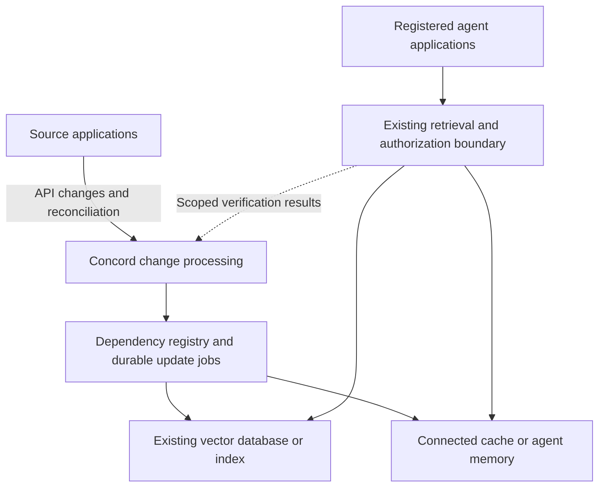

# Concord: autonomous agent-data updates

Decision date and research check: **2026-09-05**. Status: **product and engineering proposal; not implemented live functionality**. This addendum supersedes any earlier interpretation that a customer manually identifies each change or that permission checking defines the whole product. The earlier permission-first commercial recommendation was an unvalidated hypothesis.

## Decision

Concord should automatically detect supported changes in connected source applications, update affected registered agent data, and verify the result through the customer's actual consumption routes. A person or another agent can make the source change. The customer configures connections, coverage and policies during onboarding; routine source changes do not require a Concord button click.

Retain the broader message: **Keep your AI agents’ data up to date.** The commercial first proof should include an automatic **content update**, with deletion and authorization cases included only within explicitly supported semantics. Do not build a general-purpose API hub or replace the customer's whole RAG stack without evidence that they need that.

## What the existing code actually does

These are code observations, not vendor claims:

| Component | Current state | Required next boundary |
|---|---|---|
| `components/concord/workspace.tsx` | Manual sample document/scenario injection and step-by-step repair/verify | Clearly labeled demo lab; future automatic activity view |
| `backend/concord/application/engine.py: detect()` | Mutates a synthetic source and generates the sample event | Keep simulation separate from accepting observed external changes |
| `application/ports.py: SourceConnector` | Reads an object and probes an identity | Add change-feed/cursor, coverage and source-version contracts |
| Python graph and local index | Registered dependencies, repair, readback, failure/epoch checks | Reuse invariants; add durable jobs, real adapters and revision publication |
| Python API | Loopback sandbox, one operator bearer token, SQLite fixture state | Separate authenticated customer runtime and event ingestion |
| BookStack/Qdrant | Transport examples and synthetic contract tests | Complete live source/destination semantics and integration proof |
| Identities and tenancy | Alex/Jordan fixture names; no production tenant identity model | Tenant-scoped connection/object IDs and trusted application identities |

The current 21 Python tests and four WebAssembly scenarios verify the fixture engine. They do not demonstrate automatic event collection from a customer's applications. The existing simple ACL combination is not a general organizational permission resolver.

## Intended customer workflow

1. Connect one authoritative source and grant a scoped service connection.
2. Register the existing downstream dataset, rebuild/invalidation hook and agent retrieval route. Discover IDs and dependencies automatically where the ingestion metadata supports it; an engineer completes missing setup mapping once.
3. Declare supported objects, change types, transformations, caches, permissions, freshness policy and verification checks. Show unknown/unsupported coverage explicitly.
4. Run a controlled source edit during setup and validate the complete route.
5. Activate background operation. Concord consumes changes, updates affected data, retries transient failures and verifies the outcome.
6. The operator uses the console for connection health, update lag, evidence and exceptions. Human approval is reserved for actions whose policy requires it.

Configuration during onboarding is necessary. Selecting every changed document during normal operation is not.

## Where Concord sits

The principal function coordinates **source applications → derived data → consuming applications**. A component between a RAG retriever and its database is a useful enforcement hook on that route, but cannot perform the whole job.

The update loop normally runs outside the user request. Retrieval checks use the customer's existing endpoint or hook; a new universal gateway is not mandatory for a content-freshness pilot. A route claiming enforcement must have a real gate that cannot be bypassed within its declared scope.

RAG is a retrieval-and-generation workflow, not another database. An agent reading a live API may have no vector database. An agent with response caches, saved context or checkpointed memory has additional data surfaces. Cover each surface only if its identifiers and update/invalidation/verification operations are available. Updating other authoritative business applications is a separate write-back automation scope, not an automatic consequence of updating agent data.

## How automatic detection works

**Documented fact:** Google Drive's change collection can be consumed using saved page tokens; it exposes current file state. Watch notifications signal that the feed must be read; they do not carry every changed field. [Google Drive changes](https://developers.google.com/workspace/drive/api/guides/manage-changes), checked 2026-09-05.

**Documented fact:** notifications have provider-specific subscription and renewal behavior. [Drive push notifications](https://developers.google.com/workspace/drive/api/guides/push), checked 2026-09-05.

**Documented fact:** Microsoft Graph delta clients must handle duplicate/replayed state, delay and cases requiring resynchronization. [Graph delta overview](https://learn.microsoft.com/en-us/graph/delta-query-overview), checked 2026-09-05.

**Engineering inference:** use a durable change cursor with scheduled polling; add notifications to reduce latency where supported. Reconcile periodically against authoritative source state. A notification is an input signal, not permission to trust arbitrary supplied content or delete records.

The contract is convergence to the newest **observable authorized state**, not capture of every keystroke or every intermediate revision. Human and agent edits use the same loop when both are exposed by the source. Record an actor only when supplied by trustworthy source evidence; otherwise use `unknown`. Attribution is not required to refresh data.

## Reference use case

A B2B software company already runs a support agent and a Customer Success agent over its product knowledge. An authorized person changes a support document's API limit from 100 to 150; later, an authorized service agent updates another document through the source API.

Without a Concord console action, the connector observes the new source revision. Concord identifies the registered chunks and derived records, requests a rebuild through the existing transform pipeline, updates the connected destination and invalidates the covered cache. It then reads back the revision and invokes both real retrieval routes using a unique test fact and source identifiers. The old replaced chunks must not be selected on the covered routes. An unrelated document must remain available.

The result is an automatically processed change, measured freshness, scoped verification evidence, and visible failures. This proves updated retrieval context under the tested conditions; it does not guarantee that a language model always produces the correct answer.

## Smallest commercial scope

**ICP hypothesis:** a B2B SaaS team that owns its agent application, retrieval code and existing data pipeline, and can document recurring stale-data incidents or maintenance work. User: AI Platform/Backend lead. Budget owner: CTO/VP Engineering. Security approves the selected data and access model.

An AI implementation company can be a better initial customer if it controls the installation, has budget and repeats the same stack across at least two clients. A one-off bespoke project is not evidence of repeatable product deployment.

Start with one source scope, one existing destination and one real agent route. Add a second genuinely distinct application/retrieval route during the paid pilot to test reuse; two display names over the same endpoint are insufficient evidence. Connect an active cache only if it is on those routes. Do not build general agent-memory support for a pilot that does not use it.

Choose the first source and destination from qualified customers. Retain the prior Confluence-first commercial preference unless customer evidence changes it; Drive is a documented reference for detection mechanics, not a mandate to change the customer's stack. BookStack remains a technical fixture, not proof of commercial connector demand.

## Required engineering pieces

| Piece | Minimum contract |
|---|---|
| Source change adapter | Tenant/connection scope, stable object ID, observable version, current state, durable cursor, supported event kinds and health |
| Durable inbox/jobs | Acknowledge after durable acceptance; resume after restart; bounded retries and visible terminal failures |
| Dependency registry | Source ID/version → transform version → chunk/vector/cache ID → consuming route; explicit unknowns |
| Source observer | Accept observed changes without mutating the real source; retain a separate demo event generator |
| Rebuild adapter | Invoke the customer's transform or embedding pipeline; update/delete registered derivatives only |
| Version publication | Idempotency, per-object sequencing or fencing, compare-before-publish; older jobs cannot overwrite newer state or resurrect tombstones |
| Verification adapter | Destination readback plus real application retrieval probes; expected and observed version/content/authorization; unaffected controls |
| Operations | Last source check, cursor health, oldest pending update, per-route verification, expiry/reauthorization and exception ownership |

An initial Python service/worker with a durable relational job table can be sufficient. Kafka, a graph database, LangGraph orchestration and an LLM controller are not prerequisites. Models may help explain results or propose mappings, but must not be the authority for deletion, access grants or claims of complete coverage.

There is no atomic transaction spanning an arbitrary SaaS application, vector database and all agents. Versioned publication and verification must account for partial completion. A vector upsert acknowledgement is not application-level proof. [Qdrant upsert API](https://api.qdrant.tech/api-reference/points/upsert-points), checked 2026-09-05; the architecture above is our inference.

## Security and freshness policy

| Situation | Proposed behavior |
|---|---|
| Ordinary content update, current authorization known | Update in the background; a customer-approved bounded stale-content window may allow the last verified revision |
| Freshness deadline exceeded | Declare the breach; block or explicitly surface stale data according to the agreed route policy |
| Detected revocation/restricted deletion/sensitivity increase on an enforcement route | Contain affected reads until current policy and destination behavior verify |
| Effective authorization unknown | Unknown cannot grant sensitive access; use independent authoritative authorization or contain the affected enforced route |
| Source connection unavailable or overdue reconciliation | Coverage is unknown; do not label the workspace current because the queue is empty |
| Complex ACLs unresolved in a content-only experiment | Use public or explicitly unrestricted data with a documented uniform access model; make no permission-enforcement claim |

Content TTL does not preserve authorization. Event-driven containment begins after detection; it cannot by itself eliminate the earlier revocation-to-detection window. Stronger access promises require checks at the relevant read boundary. Already delivered text cannot be recalled.

Validate incoming signals with the provider's actual mechanism, bind connections/resources to their tenant, separate source and destination credentials, and keep source text out of control decisions. A current document may still contain malicious instructions. [GitHub webhook validation](https://docs.github.com/en/webhooks/using-webhooks/validating-webhook-deliveries) and [OWASP prompt injection guidance](https://genai.owasp.org/llmrisk/llm01-prompt-injection/), checked 2026-09-05.

Saved agent threads and cross-thread stores require their own handling; updating a vector database does not rewrite them. [LangGraph persistence](https://docs.langchain.com/oss/python/langgraph/persistence), checked 2026-09-05. Unsupported memory, direct bypass routes, in-flight context, offline copies, backups and model weights are outside the initial promise.

## Acceptance plan: proposed tests, not existing achievements

1. Human UI edit and authorized agent API edit, both outside Concord: new content reaches the real route with no per-change operator action.
2. A second agent route uses the same update/verification contract without a new bespoke pipeline.
3. At least 30 controlled changes; every one converges or records a specific failure/unknown. No unexplained green result.
4. Start with an experimental content freshness target of **p95 under five minutes**, subject to source/workload measurement. Measure source commit → API visibility → observation → repair → verification separately. p95 is not a maximum; also agree an absolute freshness deadline and breach behavior.
5. Drop callbacks, expire a subscription and restart a worker; cursor/reconciliation recover work without silent loss.
6. Replay duplicates and deliver old revisions after newer content/deletion; no rollback, resurrection or release of newer containment.
7. Fail embeddings, destination writes, caches and probes independently; preserve per-route outcomes and avoid global success.
8. For supported permission semantics, test revoked identity, allowed identity and unrelated allowed content. Unknown inheritance/group semantics must not pass.
9. Test a saved-context/direct-route bypass. Integrate it or explicitly exclude it; do not count it as covered.
10. Compare maintenance time, recovery effort and installation cost against the customer's existing connector/pipeline before asking for continuation payment.

The previous $10k pilot and $2–4k/month pricing remain hypotheses. Do not revise fundraising or revenue claims upward based on this clarification.

## Product/engineering/security cross-review decisions

| Question | Decision and unresolved evidence |
|---|---|
| Was manual change selection intended for customers? | No. It is fixture injection and must be visibly labeled as such. |
| Should permissions define the launch? | Not on current evidence. Demonstrate automatic content updates; retain permission safety where supported. |
| Must we build a gateway first? | No for a content pilot with usable customer retrieval hooks. Yes to an enforceable boundary for any promised blocking behavior. |
| Must we choose Drive + Qdrant? | No. Use customer-owned systems; the documented reference does not select the market. |
| Are durable cursors/recovery overbuilding? | No; they are essential to reliable automation. A complex distributed platform is not. |
| Can ordinary stale content be temporarily served? | Only within an explicit policy and valid authorization; never present a percentile target as a hard bound. |
| Is this a business yet? | Unknown. A paid, repeated installation and lower customer effort than alternatives are still required. |

**Vendor-documented alternatives already automate synchronization:** [Paragon Managed Sync](https://docs.useparagon.com/managed-sync/overview) documents normalized change processing, notifications and recovery mechanisms; [Ragie Connect](https://www.ragie.ai/connectors) markets managed synchronization; [Azure scheduled indexers](https://learn.microsoft.com/en-us/azure/search/search-howto-schedule-indexers) provide a native option. Checked 2026-09-05; these were not independently benchmarked in this review.

The proposed distinction is verifiable updates in the customer's existing agent-data stack, with repeatable installation and lower ongoing effort. Automatic API connectivity alone is insufficient differentiation. If native or managed tools solve the measured need more cheaply, change the offer or stop expanding this coordination layer.

## Concrete UI proposal for approval (no Site edits in this review)

Retain the stone/plant family and current broad headline. The following changes clarify the existing demo, without claiming live integrations:

| Existing or proposed surface | Exact proposed copy / behavior |
|---|---|
| Product support line | `Concord is designed to detect source changes, update connected agent data, and verify the result.` |
| Simulation heading | `Demo lab` |
| Simulation explanation | `In a connected deployment, changes arrive from your applications. Here, you create a sample change to explore the workflow.` |
| Sample document / Scenario | `Demo document` / `Example change` |
| Run source change | `Simulate a source change` |
| Manual repair / verify controls | `Next demo step: update sample data` / `Next demo step: verify the update` |
| Leading example | Content update; permission and deletion remain additional examples |
| Future live activity | Observed source/revision, affected routes, update stage, verification and connection health |
| Actor field | `Reported actor`; fallback `Actor not provided by source` |
| Result state | `Verified · revision N`, not an unbounded `Always current` |

A code review also found that one summary card maps any observation other than `allow` to `Denied`. The proposed UI patch must handle `allow`, `deny` and `unknown` explicitly and remain consistent with the evidence record.

Acceptance for this UI-only patch: a first-time visitor can distinguish simulation from planned automatic operation; content/permission/deletion messages match their checks; unknown never appears as denied/pass; four fixture outcomes and JSON exports remain correct; existing artwork and navigation remain intact. Test the touched screens and all four scenarios. Rollback: revert this isolated UI commit and republish the prior saved Site version if it was deployed. No data migration is involved.

The real automation milestone is a separate engineering scope: source adapter + durable observer/jobs + destination hook + actual route verification. It requires the customer's source account, chosen destination/pipeline, test routes and access model. Do not publish a mock Connect or fake live-health state as completion.

## Harmony reference

The name is ambiguous. [Harmony.io AI Agent Builder](https://harmony.io/platform/ai-agent-builder) and [Jitterbit Harmony](https://www.jitterbit.com/harmony/) are different official products with integration/automation messaging, checked 2026-09-05. No identity or architectural equivalence was inferred. The exact URL/API documentation is needed for a specific build-versus-integrate comparison.

## Review provenance

Separate agents reviewed product/GTM, R&D/data, defensive security and UX; the team lead synthesized their independent positions and a cross-review on gateway necessity, stale-data policy, customer selection and repeatability. Consensus is limited to the product contract and engineering requirements above. Customer willingness to pay, the first commercial connector and the strongest budget owner remain unproven. This was a focused architecture/product correction, not a new exhaustive market study.
