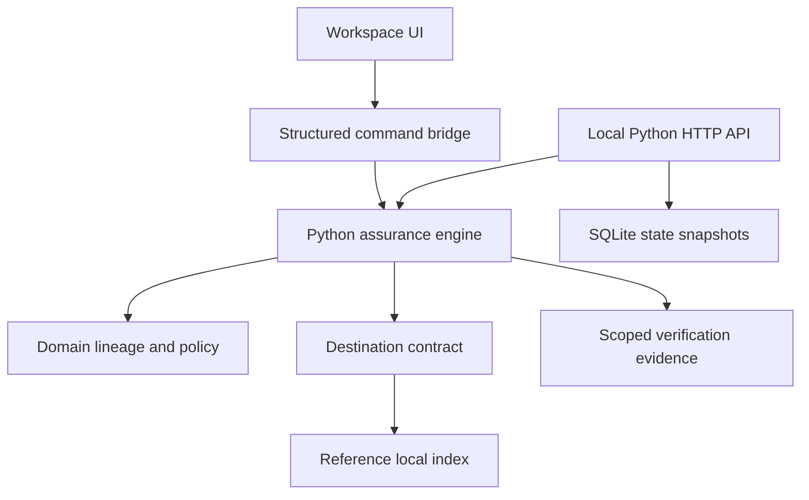
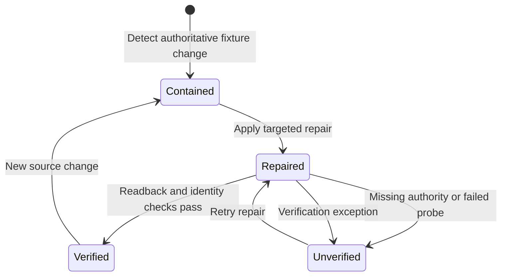

# Concord — implemented architecture and build decisions

Date: 5 September 2026. New product built from a clean checkout. This document is the implementation record; the companion technical research describes a broader target architecture.

## What this version delivers

**בעברית:** בניתי סביבת עבודה חדשה לקונקורד עם מנוע פייתון אמיתי. הדמו משתמש בנתונים סינתטיים, אך חישוב התלויות, החסימה, התיקון ובדיקות הגישה מבוצעים בפועל. יש גם חבילת פייתון עצמאית עם API מקומי ובדיקות. חיבור חי ל־BookStack או למסד וקטורי עדיין לא אומת, ומחקר השוק אינו מוכיח התאמה לשוק — הוא מגדיר השערה ממוקדת לפיילוט.

The product is a **working assurance sandbox**. It contains three synthetic source documents and nine explicitly registered derivatives: chunk, retrieval record and agent-memory record for each source. These are local records, not a real embedded vector collection or an external agent's memory.

The four scenarios are permission revocation, document update, deletion and verification outage. The operator performs three meaningful actions: detect/contain → repair → verify. A separate identity selector probes the actual protected retrieval function. The API and hosted sandbox are separate sessions using the same engine code.

| Surface | Implemented behavior |
|---|---|
| Overview | Scenario controls, counts calculated from engine state, selected lineage, session activity and ordered remediation actions |
| Lineage map | Inspect all 12 registered objects; show revisions, containment and identity retrieval |
| Connections | Honest readiness states; download pilot code and identify required external inputs |
| Evidence | Inspect per-record checks, filter results and export individual/all JSON proofs |
| Product brief | Concise customer problem, product mechanism, initial ICP hypothesis and research download |

No customers, usage, revenue, live connections, ROI, latency savings or successful enterprise deployments are fabricated. Counts reflect this synthetic dataset and the current session only.

## Python implementation and hosting boundary

The domain and application engine are written in Python. The browser's visual presentation is React/TypeScript, HTML and CSS. It sends structured commands to an isolated Web Worker running CPython through **Pyodide 314.0.6**, with runtime assets served from the same site. Business logic is not duplicated in JavaScript. The initial read-only snapshot is generated from the Python fixture during packaging. A failed engine load disables actions; there is no fake JavaScript-success fallback.

A browser is a demonstration environment, not a trusted enforcement point for customer data. The hosted demo contains no customer credentials or real source material. It resets on reload and allows export before reset. The separate dependency-free Python HTTP API runs the same application locally with a bearer-authenticated operator, bounded JSON commands, a single request thread and atomic SQLite snapshots.

**The hosted site is not a deployed Python server.** Production Python hosting requires a customer-controlled service/container and a validated retrieval integration. The site does not silently claim that a local API is reachable from its hosted origin.

Pyodide's official worker design isolates Python computations from the main UI thread. The runtime adds approximately 13 MB of uncompressed first-load assets, predominantly WASM and the Python standard library; this is an explicit portability tradeoff. [Pyodide worker documentation](https://pyodide.org/en/stable/usage/webworker.html)

## Dependencies and responsibilities

This is a modular monolith. Domain code has no framework or network imports. Application services depend on protocols. Infrastructure adapters supply storage and transport. The fixture composition is separate from the policy engine.

| Directory / file | Responsibility |
|---|---|
| `backend/concord/domain/models.py` | Artifacts, changes, revision metadata, explicit containment epoch and conflict type |
| `backend/concord/domain/graph.py` | Registered DAG validation, parent/source discovery, descendant traversal and conservative source authorization |
| `backend/concord/application/engine.py` | Detect, contain, repair, verify, protected retrieval and minimized proof generation |
| `backend/concord/application/ports.py` | Source and destination protocol contracts |
| `backend/concord/adapters/local_index.py` | Separate local destination record store and identity-filtered retrieval |
| `backend/concord/adapters/sqlite_store.py` | Durable local snapshot save/restore without refreshing a contained destination on restart |
| `backend/concord/adapters/http_client.py` | Bounded JSON HTTP, timeouts, HTTPS outside loopback, no redirects and redacted errors |
| `backend/concord/adapters/bookstack.py` | Read-only page/override client; unknown effective authorization preserved |
| `backend/concord/adapters/qdrant.py` | Optional HTTP vector transport, tenant-specific IDs and mandatory query filters |
| `backend/concord/adapters/langgraph_workflow.py` | Optional repair/verify graph with injected checkpointer |
| `backend/concord/adapters/gemini.py` | Optional LangChain model integration for minimized explanatory summaries |
| `backend/concord/api/server.py` | Validated HTTP commands, operator authentication and composition |
| `backend/concord/demo.py` | Synthetic fixture and command dispatcher |
| `backend/tests/` | Core failure, adapter, restart and HTTP acceptance checks |
| `public/python-worker.mjs` | Local asset loading and serialized structured commands into Python |
| `scripts/package-python.py` | Reproducible engine archive and baseline fixture generation |

The separate local API uses the Python standard library, rather than claiming an untested FastAPI server. FastAPI is a sensible future delivery adapter; the engine would remain the same. The transport is deliberately a local, single-process prototype and not a hardened public HTTP service.

## Ten architecture rules applied

There is no objective universal ranking of the ten strongest architecture rules. These ten are practical invariants selected for Concord's actual risks.

| Rule | Concrete implementation | Remaining production extension |
|---|---|---|
| 1. Give each module one responsibility | Graph, engine, destination, transport and fixture composition are separate | Split engine use cases when real integrations increase complexity |
| 2. Depend on contracts, not vendors | Python source/destination protocols; HTTP clients outside the domain | Version and publish a connector contract suite |
| 3. Keep policy deterministic | No model decides authorization, repair completion or proof | Formal source-specific authorization evaluation |
| 4. Validate at trust boundaries | Typed dataclasses, bounded command fields, DAG/ID checks and explicit unknown state | Full schema evolution and independent tenant authentication |
| 5. Fail closed when uncertain | Containment remains during repair; unknown authority, stale records and failed probes deny retrieval | Distributed serve guard installed on every protected customer path |
| 6. Make retries safe | Request fingerprint/idempotency keys, revision validation and containment ownership epochs | Durable queue, transactional outbox and bounded retry policies |
| 7. Protect invariants across state changes | Newer overlapping events cannot be released by old work; verification exceptions recontain | Database fencing and concurrency control across workers |
| 8. Separate writes from proof | Readback, destination probes, protected retrieval probes and unrelated positive control | Actual credential/delegation and external retrieval endpoint verification |
| 9. Minimize sensitive data and preserve evidence | No source content in proofs; local content stays in the data plane; secrets stay in environment variables | Key rotation, encrypted storage, retention, signed and independently anchored evidence |
| 10. Test failure boundaries and build reproducibly | 21 Python tests, four WASM parity scenarios, exact Pyodide version and checked-in JS lockfile | Live adapter contracts, load/security testing, browser QA and release gates |

## Control loop and safety semantics

Containment is committed before repair. The local record is not served while status is blocked. Destination write success is not proof. A verified permission change denies Alex and allows Jordan; a verified deletion denies both and removes all registered records for that source. A content change serves the new revision. The unrelated positive control checks that available data was not blanket-denied.

Source authorization `None` means **unknown**, not an empty known ACL. A destination integrity mismatch denies retrieval, even if the destination claims the right revision. Graph source objects cannot depend on derivatives. Older changes cannot overwrite a newer containment epoch on a shared descendant. Exceptions after tentative verification release restore all affected objects to blocked within the serialized engine.

The protected retrieval method runs in a serial command loop. A multi-worker implementation must replace its in-process atomicity with durable concurrency controls; the prototype makes no distributed atomicity guarantee.

### Scope and cost model

For a registered DAG, descendant discovery follows only reachable outgoing edges. The implementation uses an adjacency map and queue. This bounds impact discovery by the affected reachable subgraph. Source-ancestry and expected-record checks are recomputed for each affected record; total runtime is **not proven** to be strictly proportional to the number of changed nodes. No performance benchmark or FinOps savings claim is made.

The model covers data lineage, not each SaaS application's internal codebase. It cannot find unknown copies automatically, erase already delivered answers or prove removal of information from trained model weights.

### Evidence scope

Proofs contain source revision, containment epoch, registered affected IDs, expected/observed identity outcomes, checks, timestamp, previous-record hash and SHA-256 hash. Source text is excluded. Proof scope explicitly says sandbox/local index and `live_integration=false`.

The hash chain can reveal an altered record relative to a trusted copy. It is not a digital signature, external attestation, immutable audit store, regulatory certification or proof that the fixture identities correspond to real employees.

## Requested frameworks and the API roadmap

| Topic | Role in Concord | Current status |
|---|---|---|
| LangChain | Model/provider and retriever integrations | Optional Gemini explanation adapter included; not executed |
| LangGraph | Stateful workflow orchestration around deterministic services | Optional example included; checkpoint integration not executed |
| LangSmith | Sanitized traces, evaluations and developer diagnostics | Configuration guidance only; no exported traces or live connection |
| Vector database | Derived retrieval store with source and policy metadata | Qdrant transport code and fake-transport tests; no embeddings or live collection |
| Agentic AI | Consumers of protected context; explicit agent-memory derivatives | Local memory records demonstrated; external memory integration pending |
| Lovable / Base44 | App-generation tools | Research references; not architectural equivalents of LangGraph |
| Gemini / AI Studio | Optional explanation model | No API key needed for core; use a server-side key if integrated |

LangChain and LangGraph are related but operate at different abstraction levels. LangSmith is observability/evaluation. Lovable and Base44 build applications. They are not interchangeable components. [LangChain](https://docs.langchain.com/oss/python/langchain/overview), [LangGraph](https://docs.langchain.com/oss/python/langgraph/overview), [LangSmith](https://docs.langchain.com/langsmith/observability)

The supplied YouTube video could not be opened or transcribed. Its creator's public description links the exact video ID and identifies a Lovable-style application generator. It was used as topic context, not treated as a watched or validated implementation. [Supplied video](https://www.youtube.com/watch?v=SP-b_G74Nuk), [creator description](https://www.linkedin.com/posts/dhavalsays_i-built-lovable-clone-and-published-it-to-activity-7369935165101539328-kwtQ)

The supplied AI Studio URL is a prompt workspace. Google's current documentation links a dedicated key-management page. Keys should remain in the customer server environment; none were requested, created or placed in this browser. [Gemini key guidance](https://ai.google.dev/gemini-api/docs/api-key), [AI Studio keys](https://aistudio.google.com/api-keys)

## How the earlier Concord requests shaped this rebuild

This mapping uses the available conversation history, recovered personal context and named prior artifact summaries. It does not claim that every historical message or source file was reopened.

| Earlier emphasis | Applied decision |
|---|---|
| Recent MVPs felt crowded, unclear and too generic | Product working surface with four operational views, short English copy, detailed information in sheets |
| Professional original English; do not translate Hebrew literally | Concise outcome language such as “Change, carried through” and “Don’t assume. Verify.” |
| Oak as main quality reference | One consistent metaphor paired with tangible product proof; no copied scene, brand or animals |
| Nature, vegetation, warm physical materials and motion | Original limestone rings, restrained moss/ferns and amber core; subtle motion and reduced-motion support |
| Larger regular text and clear hierarchy | Large operational headings, semantic controls and responsive layouts; critical labels remain readable |
| Explain the idea early | An immediately runnable source-change scenario and a separate short investor-oriented brief |
| Propagate only the affected delta | Explicit source-to-derivative adjacency and targeted destination writes; no broad semantic recomputation |
| Source change → repair → actual identity outcome | Separate containment, repair and verification actions; real local readback and retrieval code |
| Customer runtime, minimized control-plane data | Browser contains synthetic data only; standalone API retains real content locally; evidence excludes content |
| BookStack first; proceed before credentials arrive | Reference engine, adapter client, tests and four-input pilot handoff completed without invented live integration |
| Many applications eventually | Replaceable transport/connector contracts; broader connectors clearly marked planned |
| Pricing and FinOps | Preserved as research hypotheses; no invented price book, ROI or market-size figures in the product |
| Founder/investor presentation | A tested product story with honest limits, competitive alternatives and measurable pilot gates |
| Python and clean architecture | Python domain/application engine, adapter boundaries, explicit invariants and documented rules |

## Design research and verification limits

The current [Awwwards Sites of the Day](https://www.awwwards.com/websites/sites_of_the_day/) listing was checked alongside the user's references: [Oak](https://www.oak.id/), [EverSwap](https://everswap.com/), [Alethia](https://www.alethia.earth/), [Nfinite](https://nfinitepaper.com/), [Son Daven](https://sondaven.com/en), [Produx](https://www.produx.design/) and [Linear](https://linear.app/). These were public-page/text research, not a claim of having visually tested every live site's animations. Awwwards recognition is a source of references, not an objective measure that this application has “the world's best UI.”

The chosen direction combines an atmospheric, original living-network sculpture with practical operations and controlled detail. The graph is an exact interface visualization; the sculpture is illustrative. Reference assets, code, wording and signature scenes were not reused.

**Completed verification:** 21 Python engine/adapter/persistence/HTTP tests; four scenarios executed in the packaged Pyodide runtime; frontend production build. The source includes mobile breakpoints, semantic Shadcn primitives, focus states and reduced-motion rules. **Not performed:** actual browser screenshots/interactions, measured accessibility or performance scoring, production penetration tests, live provider tests. No unmeasured design score is claimed.

## First live pilot handoff

Required external inputs remain the four agreed earlier:

1. BookStack API endpoint.
2. Dedicated service credentials and required permissions.
3. First AI destination — begin with the reference local index; choose a real vector store only when necessary.
4. Actual affected test identity and an authorized control identity, with supported source and destination credentials/delegation.

Then establish identity mapping and effective BookStack ACL evaluation, register actual derivatives, instrument the protected retrieval endpoint, ingest real changes, and rerun revocation, deletion, stale revision, unknown authority and outage tests. Measure change-to-containment and change-to-verified time with synchronized clocks. Validate that unrelated identities/documents continue working.

The current UI is a usable prototype and the Python engine is a validated local reference slice. Production customer integration and product-market fit are the next measurable gates.
