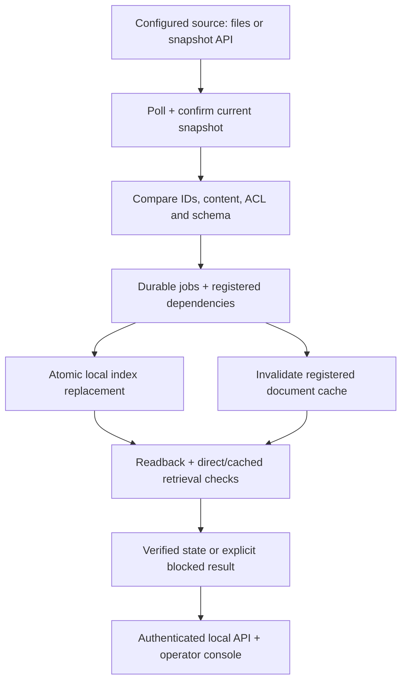

# Concord v4 — automatic data freshness

**Historical v4 record. Current scope and clarified Harmony.io deployment: [release v5](release-v5.md).**

Decision and research date: **2026-09-05**. This document supersedes the earlier permission-first product scope. The customer-installed runtime is a technical release; the public Site is a clearly labeled browser demonstration and download surface.

## CPO decision

Continue the founder's vision, with **automatic synchronization of agent-consumed data** at the center. Initial commercial hypothesis: B2B SaaS companies that own their AI ingestion and retrieval, have recurring stale-data incidents or maintenance work, and can provide access to one real source and an existing retrieval route. Primary operator: AI/backend lead. Budget owner: CTO/VP Engineering. Permissions and evidence support freshness. They do not replace it as the product category.

The prior default flow required choosing a scenario and separately running detect, repair and verify. Its code changed local fixtures and did not watch an outside source. Renaming those controls would not implement the vision. This release adds a separate, installable Python process that observes actual source state and performs the full loop without a per-change command.

Retain: stable IDs/revisions, explicit dependencies, failure states, integrity/readback checks, testable adapters, Python architecture, distinct stones and plants imagery. Change: main workflow, current-state copy, installation, source capture, durable job execution, auth boundary and contributor instructions. Unknown: real customer workload, wanted SaaS connector, authoritative enterprise ACL mapping, total integration effort and willingness to pay.

## Team and actual cross-review

Seven separate roles worked in parallel: root CPO/implementation owner; Product/GTM; distributed-runtime R&D; enterprise integrations; Security; deployment engineering; UX. These are assigned analysis roles, not invented employment histories. Independent positions are in `product-market-decision-v4.md`, `source-adapters.md`, `security-runtime-review.md` and the implementation/test artifacts.

| Question / disagreement | Evidence and decision |
| --- | --- |
| Is a local runtime enough to launch commercially? | R&D established autonomous operation. Product correctly rejected equating that with customer integration. Ship a technical release and offer a narrowly scoped paid evaluation only after integration acceptance. |
| Must the first client have two agents? | Product rejected manufacturing two routes for a narrative. Verify one existing route first; a genuinely different second route tests reuse. Current local direct/cache routes are reference implementations only. |
| Is API connectivity a differentiator? | Current Paragon, Nango, Airbyte, Ragie and especially Airweave overlap. Prove lower maintenance and verified propagation inside the existing customer stack. No exclusivity claim. |
| Should unknown permissions be allowed during content tests? | Security requires an explicit appropriate corpus/identity policy. Unknown ACL blocks. BookStack public-content mode is an operator declaration, not effective ACL discovery. |
| Can polling replace every event? | It reconciles current exposed state after missed notifications. It does not capture every intermediate edit or establish whether a human/agent caused it. Actor metadata is optional if exposed. |
| What is still contested? | SaaS vs internal-AI ICP, economic advantage over managed sync, snapshot cost at real scale, and whether customers accept integration effort. Customer evidence must resolve these. |

Concrete review fixes included stale-worker fencing, redacted source exceptions, bounded API lock waits, truncated HTTP response rejection, unknown-ACL job state, historical UI states, metric naming and readability.

## Architecture and operation

The runtime currently owns one local reference index; the commercial architecture should coordinate adapters at the customer's ingestion and retrieval boundaries. It is not necessarily a new mandatory request gateway between every RAG component and DB.

Example: someone changes the product support period in a connected JSON document from 30 to 45 days using their own editor. The periodic observer discovers a new content fingerprint even if a provider revision is unchanged. It journals the affected update, checks a second source snapshot, replaces chunks and ACL atomically, invalidates that document's registered cache, reads back the stored version and checks actual local retrieval. The next authorized HTTP query returns 45 days. An unrelated document stays available. No change-location selector, model retraining, manual repair, or manual verification is needed. UI search is an optional inspection, not the trigger.

The implementation uses bounded complete snapshots with two scans per tick. The first source/tenant binding and per-document IDs establish the known dependency map. It does not infer semantic relationships among arbitrary enterprise applications. Full-scan network/read cost grows with corpus bytes × polling frequency; no large-scale performance claim is made. Per-source delta/checkpoint adapters and periodic reconciliation are the next scale step.

Missing notification: next complete scan converges on currently visible state. Partial or failed scan: preserve prior indexed data but block covered reads. Missing object: only a complete authoritative scope can support removal from this connected index; it may mean no longer visible rather than globally deleted. Unsupported schema: block affected content or reject incomplete contract; do not invent a destructive migration. Partial update or failed verification: keep explicit failed/blocked jobs, retry through durable state. A newer source snapshot fences stale publication. Restart preserves SQLite state and job history. Duplicate work is idempotent; same-database competing CLI process is rejected.

The local API binds tokens to identities/routes. The source has read-only permissions; updates apply to the owned registered destination. No secrets enter public Site code. No model decides authorization. An already-delivered or in-flight answer cannot be recalled. Unknown copies, backups, arbitrary caches, long-term agent memories and model weights are outside coverage.

## Implemented scope and readiness

| Component | This release | Remaining requirement |
| --- | --- | --- |
| Local Markdown/JSON discovery | Real filesystem adapter with scoped traversal, limits, explicit ACL contract and periodic reconciliation | Linux exercised; macOS/WSL compatible code path not exercised here; native Windows filesystem adapter unsupported |
| JSON snapshot API | Real HTTPS transport and complete-snapshot contract; local HTTP tests | Source owner must implement contract; live customer endpoint/load validation |
| BookStack | Configured page-content polling transport and contract tests | Credentials, live instance, inventory/effective ACL/delete semantics; unknown ACL blocks by default |
| Index + cache | Real durable SQLite text/chunk index and registered document cache | Customer VectorDB/embedding/ingestion adapter; current index is lexical, not vector search |
| Retrieval | Direct and cached local implementations; authenticated HTTP tested | Existing customer retrieval URL/instrumentation and authoritative app authorization |
| Public website | Same Python core in browser worker; independent sample-source writes and timed observation | Browser session is sample-only and volatile; browser throttling affects interval |
| Commercial operation | Measurable paid-pilot design | Buyer commitment, same-stack repeated install, support/economics, enterprise security deployment |

## Freshness measurement

“Always current” is a product objective, not an unconditional SLA. The UI shows the age of the last complete scan and known coverage. The historical core field `sync_lag_seconds` contains **observation age**, not propagation latency. The read freshness budget defaults to 60 seconds since the last complete successful observation. A known incomplete scan blocks immediately. Permission revocation cannot be enforced before the source exposes it and Concord observes it; the delay must be measured and agreed.

For a pilot, record source commit time (if known), API visibility, detection, target write and first verified response per actual route. Proposed experimental target: p95 API-visible → verified retrieval <5 minutes, separate hard deadline and failure policy, 30 controlled changes including failures, and seven days of actual workload. Report each route and unknown time separately. No throughput, availability or rare-failure SLA has been established by local tests.

## Commercial experiment and 30/60/90 days

Pricing hypothesis, not a validated price book: **$10,000 for six weeks after integration acceptance**, then **$2,000–$4,000/month** for explicit deployment/scope/usage. Buyer supplies source access, target write/invalidation privileges, real retrieval hook, test identities, baseline incidents/hours and an accountable engineer. Success requires measured lower handling time (target 50%), correct convergence or explicit failures, preserved unrelated authorized access, and repeatability. Continuation terms are agreed before pilot start. If saved cost does not exceed subscription + customer operating cost, this price is not justified.

| Period | Product responsibility | Engineering responsibility | Gate |
| --- | --- | --- | --- |
| 0–30 days | Founder/CPO: 12 discovery interviews across SaaS, internal AI and implementers; obtain last real incident, buyer and priced scope | Validate chosen source/target contract; instrument true retrieval and baseline; record installation effort | ≥3 concrete recurring gaps and priced buyer interest; otherwise change ICP/use case |
| 31–60 days | Secure first paid evaluation after technical acceptance; agree metrics, comparison and escalation owner | Integrate one real source + existing route, source ACL, recovery and cache; measure source→route latency | Controlled changes converge or fail honestly; no unregistered coverage claims |
| 61–90 days | Evaluate continuation and second same-stack customer; compare savings/support cost | Repeat install without a customer fork; add real second route where useful; incremental source capture if measured cost warrants it | Target ≤5 Concord engineer-days and ≤8 customer engineering hours for repeat install; otherwise fix repeatability before connector expansion |

Change direction if ten qualified accounts produce no three concrete recurring gaps and no priced buyer interest; if existing alternatives win on the same workflow's total cost; or if two paid installations need separate product forks. Do not expand the connector catalog to hide missing demand.

## Change inventory, acceptance and rollback

| Priority / change | Benefit | Effort / dependency | Risk / acceptance |
| --- | --- | --- | --- |
| P0 automatic local daemon — implemented | Outside edits lead to updates without Concord actions | Medium; stable IDs, scoped source, durable DB | Real subprocess test checks content, ACL, outage, deletion and restart through HTTP |
| P0 source adapters — implemented bounded scope | Honest discovery and repeatable technical setup | Medium; API contract/completeness responsibility | Incomplete scans never imply successful deletion; limits and symlink/redirect controls tested |
| P0 workspace rewrite — implemented | Freshness and exceptions replace manual scenario workflow | Medium; shared Python status contract | Initial state unknown, source edit independent, blocked retrieval reason visible, desktop browser flow verified |
| P0 runtime distribution/docs — implemented | Teammates can run with their own files | Low/medium; Python 3.11+, POSIX filesystem | Fresh initialization, owner-only credentials, no overwrite, source binding and packaged console |
| P1 actual customer stack adapter — pending access | Tests the commercial advantage | High; endpoint/target/identity owner | No live claim until end-to-end observed source→customer route proof |
| P1 incremental feed + reconciliation — pending measured need | Controls snapshot cost and missed-event recovery | Medium/high; provider-specific cursor behavior | Expired cursor, missing notifications, ordering and reconciliation acceptance |
| P2 broad memory/connector/HA catalog — deferred | Long-term organizational coverage | High; actual repeated demand | Only enumerate/update registered supported systems; avoid unsupported universality |

Release gates: CPython behavior/transport/HTTP acceptance, browser-compatible Python parity, frontend build, preview source-edit/query/ACL/failure-recovery checks, usable dialogs/navigation, accurate connection/metric copy, and preserved previous Site version. Test evidence and actual publication status are recorded separately; this document does not turn a planned check into a passing one.

Public Site rollback: retain the previously successful v3 Site version `appgprj_6a9c0fb1ff5081919f863cb560680fc8~appgver_f6e6575fbbf88191a7e099858963d366`, source `ae2b903d0e8e66ae9ca0faf5434b3fc16732752e`. Restore that saved version if the new workspace fails. No customer database migration is part of public-site publication. Local runtime rollback: stop it, preserve config/state, and run earlier code against its own preserved database; never run old/new code concurrently on one SQLite file.

## Harmony, partners and strategic independence

The intended Harmony product remains unidentified. Harmony.io and Jitterbit Harmony are distinct verified official products; no deployment equivalence is inferred. The user's explicitly described installation model is sufficient to proceed.

Wonderful can be explored as a prospective design customer/implementation partner, because its own documented platform integrates enterprise systems and describes deployment flexibility. No interest or acquisition intention is known. ADS is ambiguous and is not assigned an identity. A first customer, distributor and possible future acquirer are separate roles. Acquisition relevance would require paid repeatable use, useful source-to-consumer dependency/verification contracts, maintained integrations and evidence that the coordination reduces implementation cost. Automatic polling alone is easy to reproduce. The company must first sustain its own subscription/support economics; acquisition is not a business-model assumption.

Primary-source links, provider claims vs conclusions, dates, competitor comparison and uncertainty: see **[Product/GTM research](product-market-decision-v4.md)** and **[evidence ledger](evidence-ledger-v4.json)**. No customer interview, revenue, investor interest or benchmark was invented.

## Validation record

- 82 CPython tests passed (9.331 seconds in this environment), including actual subprocess/HTTP automatic edits, deletion, ACL, restart and independent security cases.
- The bundled WebAssembly test passed both the historical scenarios and the new separate-source automatic core, direct/cache retrieval, revocation, outage and recovery.
- A console regression uses a real HTTP `/v1/status` response and executes the shipped console script: current state/documents render and network failure clears prior cards.
- Desktop preview: content sentinel reached direct and cached retrieval without manual repair; Alex denied/Jordan allowed after ACL change; unavailable source showed blocked rows and denied retrieval; source restore recovered automatically; connection boundaries and runtime download destination inspected. Overview and Install were visually inspected with distinct stone/plant images.
- Production build completed successfully. Whole-project standalone TypeScript check still reports pre-existing Cloudflare ambient-type gaps; no new UI type error appeared.
- Mobile viewport visual QA and a real external/customer integration were not performed. Responsive styles were implemented and reviewed; no visual-mobile pass is claimed.

Publication completion is reported by the deployment system separately from these pre-publication gates.
