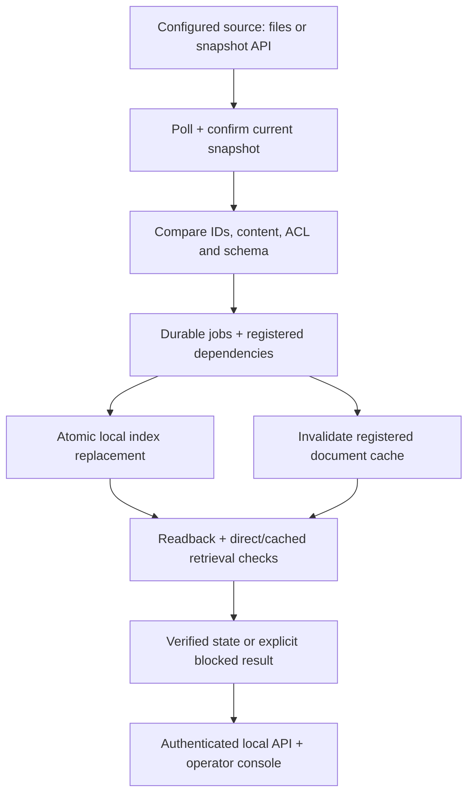

# Concord v4 — automatic data freshness

Decision and research date: **2026-09-05**. This document supersedes the earlier permission-first product scope. The customer-installed runtime is a technical release; the public Site is a clearly labeled browser demonstration and download surface.

## CPO decision

Continue the founder's vision, with **automatic synchronization of agent-consumed data** at the center. Initial commercial hypothesis: B2B SaaS companies that own their AI ingestion and retrieval, have recurring stale-data incidents or maintenance work, and can provide access to one real source and an existing retrieval route. Primary operator: AI/backend lead. Budget owner: CTO/VP Engineering. Permissions and evidence support freshness. They do not replace it as the product category.

The prior default flow required choosing a scenario and separately running detect, repair and verify. Its code changed local fixtures and did not watch an outside source. Renaming those controls would not implement the vision. This release adds a separate, installable Python process that observes actual source state and performs the full loop without a per-change command.

Retain: stable IDs/revisions, explicit dependencies, failure states, integrity/readback checks, testable adapters, Python architecture, distinct stones and plants imagery. Change: main workflow, current-state copy, installation, source capture, durable job execution, auth boundary and contributor instructions. Unknown: real customer workload, wanted SaaS connector, authoritative enterprise ACL mapping, total integration effort and willingness to pay.

## Team and actual cross-review

Seven separate roles worked in parallel: root CPO/implementation owner; Product/GTM; distributed-runtime R&D; enterprise integrations; Security; deployment engineering; UX. These are assigned analysis roles, not invented employment histories. Independent positions are in `product-market-decision-v4.md`, `source-adapters.md`, `security-runtime-review.md` and the implementation/test artifacts.

| Question / disagreement | Evidence and decision |
| --- | --- |
| Is a local runtime enough to launch commercially? | R&D established autonomous operation. Product correctly rejected equating that with customer integration. Ship a technical release and offer a narrowly scoped paid evaluation only after integration acceptance. |
| Must the first client have two agents? | Product rejected manufacturing two routes for a narrative. Verify one existing route first; a genuinely different second route tests reuse. Current local direct/cache routes are reference implementations only. |
| Is API connectivity a differentiator? | Current Paragon, Nango, Airbyte, Ragie and especially Airweave overlap. Prove lower maintenance and verified propagation inside the existing customer stack. No exclusivity claim. |
| Should unknown permissions be allowed during content tests? | Security requires an explicit appropriate corpus/identity policy. Unknown ACL blocks. BookStack public-content mode is an operator declaration, not effective ACL discovery. |
| Can polling replace every event? | It reconciles current exposed state after missed notifications. It does not capture every intermediate edit or establish whether a human/agent caused it. Actor metadata is optional if exposed. |
| What is still contested? | SaaS vs internal-AI ICP, economic advantage over managed sync, snapshot cost at real scale, and whether customers accept integration effort. Customer evidence must resolve these. |

Concrete review fixes included stale-worker fencing, redacted source exceptions, bounded API lock waits, truncated HTTP response rejection, unknown-ACL job state, historical UI states, metric naming and readability.

## Architecture and operation

The runtime currently owns one local reference index; the commercial architecture should coordinate adapters at the customer's ingestion and retrieval boundaries. It is not necessarily a new mandatory request gateway between every RAG component and DB.

Example: someone changes the product support period in a connected JSON document from 30 to 45 days using their own editor. The periodic observer discovers a new content fingerprint even if a provider revision is unchanged. It journals the affected update, checks a second source snapshot, replaces chunks and ACL atomically, invalidates that document's registered cache, reads back the stored version and checks actual local retrieval. The next authorized HTTP query returns 45 days. An unrelated document stays available. No change-location selector, model retraining, manual repair, or manual verification is needed. UI search is an optional inspection, not the trigger.

The implementation uses bounded complete snapshots with two scans per tick. The first source/tenant binding and per-document IDs establish the known dependency map. It does not infer semantic relationships among arbitrary enterprise applications. Full-scan network/read cost grows with corpus bytes × polling frequency; no large-scale performance claim is made. Per-source delta/checkpoint adapters and periodic reconciliation are the next scale step.

Missing notification: next complete scan converges on currently visible state. Partial or failed scan: preserve prior indexed data but block covered reads. Missing object: only a complete authoritative scope can support removal from this connected index; it may mean no longer visible rather than globally deleted. Unsupported schema: block affected content or reject incomplete contract; do not invent a destructive migration. Partial update or failed verification: keep explicit failed/blocked jobs, retry through durable state. A newer source snapshot fences stale publication. Restart preserves SQLite state and job history. Duplicate work is idempotent; same-database competing CLI process is rejected.

The local API binds tokens to identities/routes. The source has read-only permissions; updates apply to the owned registered destination. No secrets enter public Site code. No model decides authorization. An already-delivered or in-flight answer cannot be recalled. Unknown copies, backups, arbitrary caches, long-term agent memories and model weights are outside coverage.

## Implemented scope and readiness

| Component | This release | Remaining requirement |
| --- | --- | --- |
| Local Markdown/JSON discovery | Real filesystem adapter with scoped traversal, limits, explicit ACL contract and periodic reconciliation | Linux exercised; macOS/WSL compatible code path not exercised here; native Windows filesystem adapter unsupported |
| JSON snapshot API | Real HTTPS transport and complete-snapshot contract; local HTTP tests | Source owner must implement contract; live customer endpoint/load validation |
| BookStack | Configured page-content polling transport and contract tests | Credentials, live instance, inventory/effective ACL/delete semantics; unknown ACL blocks by default |
| Index + cache | Real durable SQLite text/chunk index and registered document cache | Customer VectorDB/embedding/ingestion adapter; current index is lexical, not vector search |
| Retrieval | Direct and cached local implementations; authenticated HTTP tested | Existing customer retrieval URL/instrumentation and authoritative app authorization |
| Public website | Same Python core in browser worker; independent sample-source writes and timed observation | Browser session is sample-only and volatile; browser throttling affects interval |
| Commercial operation | Measurable paid-pilot design | Buyer commitment, same-stack repeated install, support/economics, enterprise security deployment |

## Freshness measurement

“Always current” is a product objective, not an unconditional SLA. The UI shows the age of the last complete scan and known coverage. The historical core field `sync_lag_seconds` contains **observation age**, not propagation latency. The read freshness budget defaults to 60 seconds since the last complete successful observation. A known incomplete scan blocks immediately. Permission revocation cannot be enforced before the source exposes it and Concord observes it; the delay must be measured and agreed.

For a pilot, record source commit time (if known), API visibility, detection, target write and first verified response per actual route. Proposed experimental target: p95 API-visible → verified retrieval <5 minutes, separate hard deadline and failure policy, 30 controlled changes including failures, and seven days of actual workload. Report each route and unknown time separately. No throughput, availability or rare-failure SLA has been established by local tests.

## Commercial experiment and 30/60/90 days

Pricing hypothesis, not a validated price book: **$10,000 for six weeks after integration acceptance**, then **$2,000–$4,000/month** for explicit deployment/scope/usage. Buyer supplies source access, target write/invalidation privileges, real retrieval hook, test identities, baseline incidents/hours and an accountable engineer. Success requires measured lower handling time (target 50%), correct convergence or explicit failures, preserved unrelated authorized access, and repeatability. Continuation terms are agreed before pilot start. If saved cost does not exceed subscription + customer operating cost, this price is not justified.

| Period | Product responsibility | Engineering responsibility | Gate |
| --- | --- | --- | --- |
| 0–30 days | Founder/CPO: 12 discovery interviews across SaaS, internal AI and implementers; obtain last real incident, buyer and priced scope | Validate chosen source/target contract; instrument true retrieval and baseline; record installation effort | ≥3 concrete recurring gaps and priced buyer interest; otherwise change ICP/use case |
| 31–60 days | Secure first paid evaluation after technical acceptance; agree metrics, comparison and escalation owner | Integrate one real source + existing route, source ACL, recovery and cache; measure source→route latency | Controlled changes converge or fail honestly; no unregistered coverage claims |
| 61–90 days | Evaluate continuation and second same-stack customer; compare savings/support cost | Repeat install without a customer fork; add real second route where useful; incremental source capture if measured cost warrants it | Target ≤5 Concord engineer-days and ≤8 customer engineering hours for repeat install; otherwise fix repeatability before connector expansion |

Change direction if ten qualified accounts produce no three concrete recurring gaps and no priced buyer interest; if existing alternatives win on the same workflow's total cost; or if two paid installations need separate product forks. Do not expand the connector catalog to hide missing demand.

## Change inventory, acceptance and rollback

| Priority / change | Benefit | Effort / dependency | Risk / acceptance |
| --- | --- | --- | --- |
| P0 automatic local daemon — implemented | Outside edits lead to updates without Concord actions | Medium; stable IDs, scoped source, durable DB | Real subprocess test checks content, ACL, outage, deletion and restart through HTTP |
| P0 source adapters — implemented bounded scope | Honest discovery and repeatable technical setup | Medium; API contract/completeness responsibility | Incomplete scans never imply successful deletion; limits and symlink/redirect controls tested |
| P0 workspace rewrite — implemented | Freshness and exceptions replace manual scenario workflow | Medium; shared Python status contract | Initial state unknown, source edit independent, blocked retrieval reason visible, desktop browser flow verified |
| P0 runtime distribution/docs — implemented | Teammates can run with their own files | Low/medium; Python 3.11+, POSIX filesystem | Fresh initialization, owner-only credentials, no overwrite, source binding and packaged console |
| P1 actual customer stack adapter — pending access | Tests the commercial advantage | High; endpoint/target/identity owner | No live claim until end-to-end observed source→customer route proof |
| P1 incremental feed + reconciliation — pending measured need | Controls snapshot cost and missed-event recovery | Medium/high; provider-specific cursor behavior | Expired cursor, missing notifications, ordering and reconciliation acceptance |
| P2 broad memory/connector/HA catalog — deferred | Long-term organizational coverage | High; actual repeated demand | Only enumerate/update registered supported systems; avoid unsupported universality |

Release gates: CPython behavior/transport/HTTP acceptance, browser-compatible Python parity, frontend build, preview source-edit/query/ACL/failure-recovery checks, usable dialogs/navigation, accurate connection/metric copy, and preserved previous Site version. Test evidence and actual publication status are recorded separately; this document does not turn a planned check into a passing one.

Public Site rollback: retain the previously successful v3 Site version `appgprj_6a9c0fb1ff5081919f863cb560680fc8~appgver_f6e6575fbbf88191a7e099858963d366`, source `ae2b903d0e8e66ae9ca0faf5434b3fc16732752e`. Restore that saved version if the new workspace fails. No customer database migration is part of public-site publication. Local runtime rollback: stop it, preserve config/state, and run earlier code against its own preserved database; never run old/new code concurrently on one SQLite file.

## Harmony, partners and strategic independence

The intended Harmony product remains unidentified. Harmony.io and Jitterbit Harmony are distinct verified official products; no deployment equivalence is inferred. The user's explicitly described installation model is sufficient to proceed.

Wonderful can be explored as a prospective design customer/implementation partner, because its own documented platform integrates enterprise systems and describes deployment flexibility. No interest or acquisition intention is known. ADS is ambiguous and is not assigned an identity. A first customer, distributor and possible future acquirer are separate roles. Acquisition relevance would require paid repeatable use, useful source-to-consumer dependency/verification contracts, maintained integrations and evidence that the coordination reduces implementation cost. Automatic polling alone is easy to reproduce. The company must first sustain its own subscription/support economics; acquisition is not a business-model assumption.

Primary-source links, provider claims vs conclusions, dates, competitor comparison and uncertainty: see **[Product/GTM research](product-market-decision-v4.md)** and **[evidence ledger](evidence-ledger-v4.json)**. No customer interview, revenue, investor interest or benchmark was invented.

## Validation record

- 82 CPython tests passed (9.331 seconds in this environment), including actual subprocess/HTTP automatic edits, deletion, ACL, restart and independent security cases.
- The bundled WebAssembly test passed both the historical scenarios and the new separate-source automatic core, direct/cache retrieval, revocation, outage and recovery.
- A console regression uses a real HTTP `/v1/status` response and executes the shipped console script: current state/documents render and network failure clears prior cards.
- Desktop preview: content sentinel reached direct and cached retrieval without manual repair; Alex denied/Jordan allowed after ACL change; unavailable source showed blocked rows and denied retrieval; source restore recovered automatically; connection boundaries and runtime download destination inspected. Overview and Install were visually inspected with distinct stone/plant images.
- Production build completed successfully. Whole-project standalone TypeScript check still reports pre-existing Cloudflare ambient-type gaps; no new UI type error appeared.
- Mobile viewport visual QA and a real external/customer integration were not performed. Responsive styles were implemented and reviewed; no visual-mobile pass is claimed.

Publication completion is reported by the deployment system separately from these pre-publication gates.

---

# Concord v4 — independent Product / GTM decision

Research cutoff and all source checks: **2026-09-05**. Mode: targeted strategic opportunity test, updating the earlier study. This is an independent Product/GTM position for cross-review; it does not assert consensus, paid demand, or production integration results. No outreach was performed.

## Decision

**Continue with automatic agent-data freshness as the core product. Build a customer-side change-processing runtime; commercially qualify one existing knowledge pipeline before adding connectors broadly.** The first paid-use-case hypothesis is a B2B SaaS company whose support and Customer Success AI applications consume frequently changing product knowledge through customer-owned retrieval code. Start implementation with one real route; require a second genuinely distinct route during the evaluation to test reuse, if that second route exists in the customer's workflow.

Buyer hypothesis: CTO / VP Engineering. Operator: AI Platform / Backend lead. Security approves the scoped data and access model. Select accounts by an observed maintenance burden or documented stale-answer problem, not by employee count, AI enthusiasm, or a warm introduction. Confidence: medium on architectural fit; **low on willingness to pay**.

One-sentence product description: **Concord automatically keeps connected agent data in sync with source changes and verifies the result where agents retrieve it.** Permissions, deletion handling and evidence make that operational promise safe and inspectable; they should not replace freshness as the leading story.

## What changed in the product decision

The earlier manual scenario picker and permission-first pilot could reasonably be interpreted as a control-testing product. The founder's clarification changes the organizing workflow: configure coverage once, observe changes in the source, automatically update affected connected state, and use the console for health and exceptions. A background daemon is a material change; relabeling manual buttons is insufficient.

Retain the existing source/version identifiers, dependency tracking, repair/verification separation, unknown states and stone/plant visual language. Replace the default manual workflow with connection status, freshness, update activity and exceptions. Keep injected scenarios in an unmistakable browser demonstration. A content edit must lead the example. A successful write is not yet verified retrieval, and a clear queue does not prove a healthy source connection.

The current iteration's proposed boundary, supplied by the engineering lead, is a real Python polling runtime for local Markdown/JSON and an explicit complete HTTP-snapshot contract, durable SQLite state and lexical retrieval, with direct and cached local routes. The public site demonstrates the core against a separate sample source in the browser. BookStack transport preparation is not a live credentialed integration; its effective permission model remains unverified. Engineering's final test report must determine what can be described as working.

**Assessment:** this is a useful autonomous-runtime milestone. It shows whether outside edits can drive updates without a Concord action, including restarts and cache invalidation. It is not yet a commercial RAG connector, a vector-database integration, two installed customer agents, or proof of superiority over established alternatives. Use “Local runtime” and “Browser demonstration” as distinct statuses. Avoid calling all downloadable code production-ready.

## Buyers and alternatives

The operational frequency, costs and budget ownership below are hypotheses to measure, not established market facts.

| Segment | User / buyer hypothesis | Pain, current workaround and cost to measure | Purchase trigger | Integration barrier and decision |
|---|---|---|---|---|
| B2B SaaS owning its AI stack | AI/backend lead / CTO or VP Engineering | Product changes arrive in source but stale chunks/caches remain; rebuild jobs, managed connectors, tests and support runbooks. Measure interventions, engineer-hours and stale retrieval episodes per 30 days. | Customer-visible recurring errors or an AI release with a specific freshness acceptance requirement. | Strong internal-build alternative; tenant isolation and source semantics are real work. **First hypothesis**, because one vendor can control ingestion and retrieval and repeat the integration. |
| Midmarket company with internal AI team | AI platform engineer / Head of AI, VP Engineering or CIO | Internal knowledge changes; scheduled search indexing or an enterprise-search vendor may already suffice. Measure employee escalation and maintenance hours, rather than assume productivity loss. | A named workflow owner cannot tolerate measured lag and has a funded rollout. | Split budgets, limited engineering access, many source owners. Can become first ICP if two accounts share a supported stack and clearer paid urgency. |
| AI implementer, including Wonderful | Deployment/platform lead / CTO, delivery or platform executive | Repeated integrations and client acceptance work; native platform features, direct source calls and delivery engineering are alternatives. Measure repeatable deployment/support cost per client. | A standard component would reduce delivery cost across at least two clients. | Provider and client approvals; bespoke projects; overlapping own platform. Discovery/design partner first; distribution only after repeated installs. Wonderful describes embedded engineers and multiple deployment models, and direct access to systems of record [S9–S10]. These are vendor claims, not interest in Concord. |
| Enterprise with several independently built AI applications | Shared AI platform lead / CDO or CIO | Different ingest/index/cache implementations drift. Existing ETL, search, observability and internal platform team. Measure duplicate maintenance and demonstrable missed changes across routes. | Consolidation program with a budget owner and access to several applications. | Best long-term expression of the vision, but too much connector, permission and procurement scope for an initial two-founder delivery. |

Compare the same source, corpus, frequency and actual retrieval routes against these alternatives. Do not compare Concord against a deliberately broken or purely manual baseline.

| Strong alternative | Current primary-source evidence | Implication for Concord |
|---|---|---|
| Paragon Managed Sync | Documents initial/incremental sync, default one-minute polling, periodic full reconciliation and change notifications; supports on-premise endpoints. Permission indexing is described separately [S1–S2]. | Automatic connectors, polling recovery and private deployment already exist. Integrate or benchmark source plumbing; prove the downstream result in the customer's stack. |
| Nango | Documents webhook/polling combination, checkpoints, record cache and concurrency considerations. Enterprise self-hosting includes syncs; free self-hosting excludes them [S3–S4]. | The integration runtime itself is a capable substitute or supplier. Source code availability does not mean full managed capability is free. |
| Airbyte → Pinecone | Documents processing, embeddings, full and incremental modes; `_ab_record_id` links primary keys to replacement/deletion behavior [S5]. | Source-to-vector updating alone is insufficient differentiation. Existing pipelines may already have the mapping Concord needs. |
| Ragie Connect | Markets managed authentication, automatic sync and an integrated parsing/indexing/retrieval engine [S6]. | Strong option for customers willing to adopt managed retrieval. This review did not independently test connector availability or sync latency; the inspected connector catalog has ambiguous “Coming soon” labels. |
| Airweave | Official docs describe an open-source context retrieval layer, continuous source sync, connector-specific mapping and one search interface for agents [S7–S8]. | **Investigate now:** a close functional alternative to the broad vision. Concord must earn its place by updating and verifying existing independent routes, or by materially better economics, rather than offering another common retrieval layer. |
| Native Azure / AWS | Azure documents scheduled incremental indexing with a minimum five-minute schedule; AWS publishes an automatic Bedrock synchronization implementation [S11–S12]. | A five-minute Concord target is not unique. Compare actual end-to-end latency, intervention effort and gaps, including the native setup that the customer could deploy. |
| Internal jobs and tests | An account-specific substitute to observe, not a market statistic. | A single corpus plus one index and a reliable scheduled job may be cheap and sufficient. Exclude that account unless a real gap is demonstrated. |

All capabilities above are documented/vendor-stated, not independently benchmarked by this study. No claim is made that alternatives lack private or undocumented verification features. Differentiation is still a hypothesis: **an installable coordinator that preserves the customer's existing stack and verifies each declared consumption route, with lower maintenance than maintaining this coordination themselves.**

## A measurable first paid workflow

Illustrative event: an authorized employee updates a product limit from 100 to 150 in the source; an authorized service agent later updates another article through that source's API. Concord observes the latest exposed source revision, rebuilds only registered affected derived records through the customer's existing pipeline, invalidates an active connected cache and verifies source/version/context in the real support route. The second Customer Success route is added using the same contract. A different display name for the same endpoint does not demonstrate reuse.

The result is fresh, traceable retrieval context on the tested routes, with an explicit timestamp and unresolved failures. It is not a guarantee that an LLM always answers correctly, and does not require retraining model weights.

**Prerequisites for a paid evaluation:** one supported authoritative source scope; stable IDs and source revision/current-state contract; existing target and transform owner; actual retrieval hook(s); agreed corpus and test identities; security-approved update/invalidation privileges; access to baseline logs; one accountable buyer. Any cache in a claimed route is registered and controllable, or deliberately disabled for that route. The first commercial connector is selected from qualified customers; Confluence, Drive and SharePoint remain candidates. A BookStack fixture does not establish demand for BookStack.

## Plug and Play, expressed as a contract

| Step | Can be automatic within a supported adapter | Configuration that remains necessary |
|---|---|---|
| Discover source | List accessible supported objects, IDs, versions, formats and provider-exposed metadata. | Endpoint/account, least-privilege authorization and scope selection. No discovery beyond granted access. |
| Map derived data | Reconstruct registered relationships from ingestion metadata and stable source IDs. | Existing untagged indexes need a one-time map, instrumentation or rebuild. Similar text is not proof of lineage. |
| Connect consumers | Read an explicit deployment manifest or supported application registration. | Retrieval URL, identity context, cache/memory ownership and validation contract. An API token does not reveal all agents in an organization. |
| Operate | Poll/feed consumption, scheduled reconciliation, retry, update, readback and route tests. | Freshness deadline, failure policy, supported authorization semantics and exception owner. |
| Structure changes | Detect an incompatible contract or schema and identify affected registered work. | Approve revised mapping/transform when meaning changed. Do not guess destructive migrations using an LLM. |

Deploy the initial worker and its durable state in the customer environment as requested. Keep credentials and content within that installation by default; document any configured embedding provider or telemetry egress explicitly. A local operator console and process/container are enough for a controlled pilot; do not make a hosted control plane, universal gateway, Kubernetes, air-gapped operation and enterprise HA mandatory first-build scope. Private installation is a customer preference to validate economically, not a moat.

The complete-snapshot HTTP contract is a useful bounded adapter but shifts snapshot creation and correctness to the source owner. It needs a declared completeness marker, explicit scope and failure behavior. A partial/failed response cannot imply deletion. Cost is approximately objects × bytes per object × polls per period, plus diff/processing; measure corpus sizes before claiming scale. Delta/cursor adapters reduce unnecessary reads but do not remove reconciliation needs. The engineer's final API contract is authoritative for this release.

## Freshness and commercial acceptance

Translate “always current” into separately reported metrics. These are **proposed pilot targets**, subject to source/API and workload feasibility, not SLAs already offered:

- Report source commit → API visibility → observation → update → real-route verification separately. If a timestamp is unknown, show unknown rather than substitute an earlier/later stage.
- Initial experimental target: p95 source-visible → verified retrieval below five minutes, with source-commit lag reported independently. Agree a hard freshness deadline and stale/blocked behavior; a percentile is not a maximum.
- Report verified covered objects/routes divided by the explicitly registered in-scope population. Show unsupported types and unknown routes separately; do not divide by a guessed enterprise total.
- Exercise at least 30 controlled source changes including missing notifications, restart, duplicate/old revisions, partial target failure and schema drift. Every change converges or records a meaningful failure. Zero false “verified” results in this suite is a finite test result, not a universal reliability guarantee.
- Observe at least seven consecutive days of genuine workload after technical acceptance; measure source-health gaps, oldest pending update and manual intervention. Low-volume workloads cannot substantiate a rare-failure rate.
- Business target: at least 50% lower median human handling time for the same recurring change/failure classes against the measured existing pipeline. Preserve permitted retrieval and unrelated data. Show actual customer cost and support burden.
- Repeatability target: second same-stack install within five Concord engineer-days and eight customer engineering hours, after access is available. Both are hypotheses; initial reusable R&D is tracked separately from customer-specific delivery.

Runtime authorization remains independent from ordinary content freshness. A known content-lag window cannot justify stale permission grants. Where source permission semantics are unknown, do not advertise ACL mirroring/enforcement; use an explicitly unrestricted technical corpus or the customer's authoritative read-time authorization. This must be cross-reviewed with Security.

## Payment and costs: experiment, not a price book

Retain the prior hypothesis of **$10,000 for a six-week paid evaluation after integration acceptance**, and **$2,000–$4,000 per month** for an agreed production deployment/scope and usage allowance. Include installation/support responsibilities and customer cloud costs; pre-agree continuation terms. Do not price by vague “all users protected,” reintroduce first-app-free as proven, or charge per failure.

Nitai owns 12 discovery conversations across four SaaS vendors, four internal AI teams and four implementers, followed by technical and budget-owner qualification in the strongest segment. Ask for the last actual stale-data incident or manual refresh, source/route architecture, frequency over 30/90 days, maintenance time, current alternative, spending owner and a signed priced scope. Warm access is useful but not evidence of product fit. No outreach is performed by this memo.

Keep value arithmetic honest: measured saved hours × agreed loaded hourly cost, plus separately evidenced avoided reprocessing cost, minus subscription and customer operating cost. Do not count the entire value of a delayed contract or hypothetical breach avoidance. Illustrative assumptions: 25 saved hours × $100/hour = $2,500/month before operating costs; a $3,000 subscription would not be justified by those labor savings alone.

Count first-adapter R&D, per-customer integration, recurring connector maintenance, security support and infrastructure separately. If each installation needs a custom application rewrite or repeated professional services, revise scope/pricing rather than report SaaS margins. A local demo install in minutes does not measure enterprise approval or deployment effort.

**Reversal gates:** if ten qualified accounts yield no three concrete recurring gaps and no priced buyer interest, change ICP/use case. If native/managed alternatives solve the measured workflow at lower total cost, integrate with them or stop the overlapping component. If two paid installations cannot share a source/target contract without a fork, pause connector expansion and fix repeatability. No market sizing or revised fundraising claims are warranted by this iteration.

## Cross-review questions and position

1. **Is the local runtime enough to ship now?** Yes as an accurately labeled technical release and contributor starting point; no as a connected-enterprise launch. This preserves progress without confusing readiness.
2. **Are two routes required on day one?** No; one is the minimum engineering proof. A second real route is the subsequent reuse test where the customer has one. Do not manufacture a cache or second application to justify the product.
3. **Must we own retrieval?** No. The proposed commercial advantage depends on working with existing routes. A provided lexical reference route is useful for tests, but cannot stand in for the customer's vector search and application.
4. **Should full permission discovery block all work?** No for a declared unrestricted technical corpus. It must block sensitive access/enforcement claims until a trusted model is implemented and tested.
5. **Would I choose an internal enterprise AI team instead?** Yes if two compatible budget-backed accounts give clearer urgency and access than SaaS. Customer evidence, not narrative consistency, resolves this disagreement.

Against Airweave the next evidence is one in-demand live source connector, an existing customer's target/transform and retrieval integration without a replacement search stack, supported real permission semantics, source-to-route failure recovery, repeatable onboarding and a paid continuation. Automatic sync and self-hosting alone cannot win that comparison.

### Actual Security cross-review

The independent Security reviewer agreed that freshness remains the main workflow and that the reference runtime is not a commercial enterprise connector. I accept two qualifications to the initial position: a BookStack/public-content setting must be an explicit operator declaration tied to named destination identities, never presented as observed effective ACL; and a SaaS paid pilot must enforce per-customer source namespaces and actual application authorization, or use a dedicated scoped corpus, before sensitive production trials. The local runtime's single-tenant boundary does not solve SaaS tenancy. We agree that universal permission discovery need not block a useful automatic content-sync test with an explicitly appropriate corpus.

## Harmony and discovery limitations

The supplied materials never identify a unique Harmony URL. Two distinct official products were checked: Harmony.io's enterprise IT agent builder and Jitterbit Harmony's integration/automation platform [S13–S14]. **The intended reference remains Unknown.** Neither is used as proof of the proposed customer-installed deployment, automatic organizational mapping, or a specific installation experience. Continue from the deployment requirement the founder explicitly provided; a later exact URL can refine the comparison.

Under-the-radar pass: searched the exact theme `"RAG" "continuous sync" startup connectors`, then corroborated Airweave and Spice.ai using primary documentation/product pages. Two relevant candidates retained: Airweave **Investigate now**, Spice.ai **Monitor** (CDC into its accelerated datasets, adjacent to external-route coordination [S15]). No funding/headcount filter was used. Crunchbase Advanced Search/API access was not available in this environment; the guessed public `/organization/airweave` profile was an unrelated mattress company and was rejected. No Crunchbase funding, customer or size facts entered the decision. This is a bounded discovery pass, not an exhaustive landscape or proof of absent competitors.

## Source register

All links checked **2026-09-05**. Undated live documents unless stated. “Documented” verifies what the provider documents, not independent production performance.

| ID | Label | Primary source |
|---|---|---|
| S1 | Verified Fact — documented sync behavior | [Paragon Sync API](https://docs.useparagon.com/managed-sync/sync-api) |
| S2 | Verified Fact — documented API scope | [Paragon Managed Sync](https://docs.useparagon.com/managed-sync/overview) |
| S3 | Verified Fact — documented sync primitives | [Nango real-time syncs](https://nango.dev/docs/guides/functions/syncs/realtime-syncs) |
| S4 | Verified Fact — documented deployment/feature availability | [Nango self-hosting](https://nango.dev/docs/guides/platform/self-hosting) |
| S5 | Verified Fact — documented destination behavior | [Airbyte Pinecone connector](https://docs.airbyte.com/integrations/destinations/pinecone) |
| S6 | Vendor Claim | [Ragie Connect](https://www.ragie.ai/connectors) |
| S7 | Vendor Claim — official positioning | [Airweave introduction](https://docs.airweave.ai/welcome) |
| S8 | Verified Fact — documented architecture | [Airweave concepts](https://docs.airweave.ai/concepts) |
| S9 | Vendor Claim | [Wonderful deployment](https://www.wonderful.ai/deployment?scLang=en) |
| S10 | Vendor Claim; published 2025-12-16 | [Wonderful architecture](https://www.wonderful.ai/blog-articles/wonderful-an-enterprise-platform-to-turn-ai-ambition-into-agents-in-production?scLang=en) |
| S11 | Verified Fact — documented scheduling | [Azure indexer scheduling](https://learn.microsoft.com/en-us/azure/search/search-howto-schedule-indexers) |
| S12 | Verified Fact — published implementation | [AWS automatic Bedrock synchronization](https://aws.amazon.com/blogs/machine-learning/build-and-deploy-an-automatic-sync-solution-for-amazon-bedrock-knowledge-bases/) |
| S13 | Vendor Claim — product identity only | [Harmony.io AI Agent Builder](https://harmony.io/platform/ai-agent-builder) |
| S14 | Vendor Claim — product identity only | [Jitterbit Harmony](https://www.jitterbit.com/harmony/) |
| S15 | Vendor Claim | [Spice.ai change data capture](https://spice.ai/feature/real-time-change-data-capture) |

The Google Drive change collection and Microsoft Graph delta query were also rechecked for the independent engineering discussion: [Drive changes](https://developers.google.com/workspace/drive/api/guides/manage-changes), [Graph delta](https://learn.microsoft.com/en-us/graph/delta-query-overview). They demonstrate provider-specific observable-state mechanisms, not universal capture of every action. No unavailable provider/account was live-tested during this market review.
