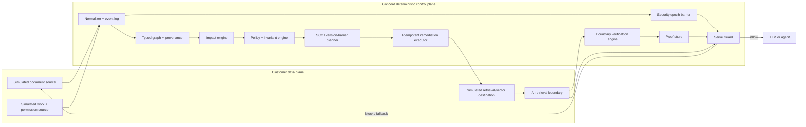

# Concord Deterministic Consistency Engine

**Formal specification, conditional correctness analysis, reference prototype, tests, and benchmark**  
Research snapshot: 2026-08-21

> **Thesis verdict:** valid only under specified conditions. Concord can deterministically prevent governed AI artifacts from being served as current after a known authoritative invalidation, provided that authoritative events are delivered, the governed consumption boundary cannot bypass Serve Guard, and dependency information is sufficiently complete or unknowns are handled conservatively. The prototype does not prove universal semantic impact detection or global consistency across unregistered systems.

---

## 1. Problem definition and assumptions

### 1.1 Problem

An authoritative enterprise object changes at logical time `t`. Downstream chunks, permission projections, embeddings, indexes, caches, retrieval views, prompts, memories, or other AI-consumable artifacts may now be invalid. Concord must:

1. observe and normalize the authoritative mutation;
2. identify every governed artifact that may be affected under a versioned dependency contract;
3. stop unsafe consumption before asynchronous repair for security events;
4. construct a safely sufficient, dependency-safe remediation plan;
5. execute actions idempotently;
6. verify the result at the actual AI consumption boundary; and
7. issue an auditable proof before restoring `VERIFIED_CURRENT`.

### 1.2 What Concord does not assume

Concord does not assume that semantic impact is always decidable. Dependency knowledge is divided into four classes:

- **Observed and proven:** produced by runtime lineage, deterministic instrumentation, or direct destination evidence.
- **Connector-declared:** asserted by a versioned connector contract. Soundness depends on the declaration being conservative and correct.
- **Inferred and uncertain:** suggested by static analysis, heuristics, or an LLM. Confidence can prioritize review but cannot certify a hard invariant.
- **Missing or unknown:** not represented by an edge, or represented by incomplete coverage. A missing edge cannot be discovered by graph traversal alone.

### 1.3 Assumptions used by correctness claims

Let the protected boundary be `B`.

- **A1 — Event delivery:** every authoritative invalidating event relevant to `B` is eventually delivered, durably logged, and uniquely identified.
- **A2 — Authority:** source versions and security epochs are issued by an authoritative system or a connector whose authority is explicitly delegated.
- **A3 — Dependency sufficiency:** every artifact in `B` either has a conservative dependency path from each required authority or is marked incomplete/unknown and blocked by Serve Guard.
- **A4 — Predicate conservatism:** `PRUNE` is returned only when the edge contract can prove non-impact.
- **A5 — Deterministic transforms:** edge predicates and transforms are pure, versioned, reproducible functions of recorded state.
- **A6 — Mediation:** every governed AI request passes through Serve Guard; bypassed or unregistered consumers are outside the guarantee.
- **A7 — Durable idempotence:** event receipts, action receipts, epochs, and proof commits are durable and compare-and-set or uniquely constrained.
- **A8 — Verification observability:** the destination exposes a deterministic retrieval, authorization, and consumed-version observable sufficient for its contract.

If A1, A3, A6, or A8 fails, no system can honestly certify end-to-end freshness from Concord's evidence alone.

### 1.4 Corrected specification conflicts

Two requested properties cannot hold without qualification:

- **Unconditional confluence is false.** Concurrent non-commutative updates such as delete and update may produce different results under different legal orders. The corrected requirement is confluence for monotonic/commutative operations or for non-monotonic operations executed behind a deterministic version barrier.
- **Cost minimization cannot decide whether mandatory work happens.** The corrected optimization is `min Cost(R)` over the feasible set of plans satisfying all hard invariants. If no plan is feasible within budget, the artifact remains blocked; the invariant is not relaxed.

---

## 2. Mathematical model

At logical time `t`, Concord maintains a dynamic typed directed multigraph:

`G_t = (V_t, E_t, tau_V, tau_E)`

Parallel edges are allowed because the same pair of nodes may be related by derivation, authorization, retrieval, or cache contracts with different evidence and versions.

### 2.1 Node

For each `v in V_t`:

`v = (canonical_id, tenant_id, type, authoritative, source_version, effective_state_hash, validity_state, policy_class, security_epoch, provenance, required_authorities, dependency_coverage, last_verified_at)`

- `canonical_id`: stable identity inside one tenant.
- `tenant_id`: mandatory isolation key.
- `type`: authoritative document/work item, permission object, chunk, vector, retrieval view, or AI artifact.
- `authoritative`: whether this node can issue source truth.
- `source_version`: `(authority, sequence, opaque)` for authoritative nodes.
- `effective_state_hash`: deterministic hash of the state relevant to downstream behavior, not necessarily the full content.
- `validity_state`: one state from the state machine in Section 4.
- `policy_class`: `hard_security`, `strict`, or `bounded_staleness`.
- `security_epoch`: latest tenant security epoch incorporated into the artifact and its proof.
- `provenance`: source-version atoms and edge evidence supporting the artifact.
- `required_authorities`: authorities that a valid proof must cover.
- `dependency_coverage`: `complete`, `partial`, or `unknown`.
- `last_verified_at`: time of the most recent successful boundary verification.

### 2.2 Normalized event

`Delta = (event_id, tenant_id, authority, object_id, mutation_type, before_version, after_version, logical_timestamp, causal_parents, idempotency_key, payload_hash, security_classification, metadata)`

Wall-clock timestamps are evidence, not ordering authority. Ordering uses source sequence and causal parents. `payload_hash` permits deterministic equality checks without requiring customer content in the control plane.

### 2.3 Security epoch

For tenant `T`, `Epoch_T` is a monotonically increasing integer stored separately from artifact rows. Receipt of an authoritative security revocation atomically advances `Epoch_T` before graph traversal or repair. A request or proof with an older epoch is rejected even if an affected artifact has not yet been discovered.

### 2.4 Provenance

The prototype stores explicit provenance atoms and edge contracts. Provenance semirings provide a stronger algebraic foundation for positive relational queries, but the prototype does not claim that arbitrary AI transformations form a commutative semiring. Where a transformation lacks valid algebraic structure, Concord stores an opaque versioned derivation and verifies behavior directly.

---

## 3. Complete edge contract

Each edge is:

`e = (edge_id, tenant_id, source, destination, dependency_type, P_e, T_e, verification_contract, criticality, evidence_type, confidence, edge_version, behavior_on_unknown, monotonic)`

### 3.1 Required fields

- `edge_id`: stable edge identity.
- `source`, `destination`: canonical node identifiers.
- `dependency_type`: derivation, authorization, indexing, cache, retrieval, or declared semantic dependency.
- `P_e(delta, source_state, destination_state)`: deterministic three-valued predicate returning `PROPAGATE`, `PRUNE`, or `UNKNOWN`.
- `T_e(delta)`: deterministic transformed delta used to compute downstream effective state.
- `verification_contract`: boundary, required observations, and version requirements.
- `criticality`: low, normal, high, or security.
- `evidence_type`: observed, declared, or inferred.
- `confidence`: optional value used only for uncertain evidence; never a hard-invariant bypass.
- `edge_version`: immutable semantics version.
- `behavior_on_unknown`: propagate, block, or explicitly allow bounded staleness for non-security policy classes.
- `monotonic`: whether repeated application is monotonic over the declared state lattice.

### 3.2 Predicate rules

`PRUNE` is a proof obligation. It is legal only if the edge contract establishes that the destination effective state and all downstream obligations are unchanged. Missing changed-field metadata, a low-confidence inferred edge, a connector timeout, or an unrecognized schema returns `UNKNOWN`, not `PRUNE`.

### 3.3 Evidence semantics

- **Observed:** may support pruning if the observation is complete for the predicate's domain.
- **Declared:** may support pruning only under the explicit connector assumption and recorded connector version.
- **Inferred:** may nominate propagation. It does not support hard-invariant pruning unless independently promoted to observed/declared evidence.
- **Missing:** cannot appear as an edge. Coverage metadata and Serve Guard must expose the guarantee gap.

---

## 4. Validity state machine

### 4.1 States

- `VERIFIED_CURRENT`: a successful proof matches active policy, tenant security epoch, required authoritative versions, and actual consumption-boundary observations.
- `BOUNDED_STALE`: a non-security policy explicitly allows temporary staleness within a recorded deadline. It is not equivalent to current.
- `PENDING`: remediation or verification is scheduled/in progress.
- `INVALID`: a known change invalidated the artifact.
- `BLOCKED_SECURITY`: consumption is denied because a security epoch or authorization requirement is unresolved.
- `VERIFICATION_FAILED`: remediation was attempted but the required boundary observation failed.
- `UNKNOWN`: dependency, event order, connector behavior, or state is insufficiently known.

### 4.2 Permitted transitions

An asterisk means successful boundary verification is mandatory.

- `VERIFIED_CURRENT -> {BOUNDED_STALE, PENDING, INVALID, BLOCKED_SECURITY, UNKNOWN, VERIFIED_CURRENT*}`
- `BOUNDED_STALE -> {PENDING, INVALID, BLOCKED_SECURITY, VERIFICATION_FAILED, UNKNOWN, BOUNDED_STALE, VERIFIED_CURRENT*}`
- `PENDING -> {INVALID, BLOCKED_SECURITY, VERIFICATION_FAILED, UNKNOWN, BOUNDED_STALE, PENDING, VERIFIED_CURRENT*}`
- `INVALID -> {PENDING, BLOCKED_SECURITY, VERIFICATION_FAILED, UNKNOWN, INVALID, VERIFIED_CURRENT*}`
- `BLOCKED_SECURITY -> {PENDING, VERIFICATION_FAILED, BLOCKED_SECURITY, VERIFIED_CURRENT*}`
- `VERIFICATION_FAILED -> {PENDING, INVALID, BLOCKED_SECURITY, UNKNOWN, VERIFICATION_FAILED, VERIFIED_CURRENT*}`
- `UNKNOWN -> {PENDING, INVALID, BLOCKED_SECURITY, VERIFICATION_FAILED, BOUNDED_STALE, UNKNOWN, VERIFIED_CURRENT*}`

`UNKNOWN -> BOUNDED_STALE` is legal only for a non-security policy class with an explicit deadline. All other transitions are forbidden. In particular, `BLOCKED_SECURITY -> BOUNDED_STALE`, `BLOCKED_SECURITY -> INVALID`, and any transition to `VERIFIED_CURRENT` without verification are forbidden.

---

## 5. Invariants and correctness conditions

### 5.1 Soundness — conditional proof sketch

**Property.** If an artifact may change under the declared dependency contract, the algorithm does not leave it in `VERIFIED_CURRENT`.

**Under A1-A5:** Consider any affected path from the changed authority to artifact `a`. By induction on path length: the first edge returns `PROPAGATE` or `UNKNOWN`; A4 forbids false `PRUNE`, and hard/strict unknowns propagate. The destination leaves `VERIFIED_CURRENT`. Applying the same argument to each next edge reaches `a`. Therefore `a` is invalidated or blocked before it can be certified again.

**Disproof without A3:** Remove the only edge to `a` and leave `a` marked complete. Traversal cannot visit `a`; it may remain apparently current. Therefore soundness is conditional on sufficiently complete dependency information and event delivery. The prototype test deliberately constructs this counterexample and confirms Serve Guard refuses to invent a proof when coverage is incomplete.

### 5.2 No false freshness — proof sketch

The transition function rejects every move to `VERIFIED_CURRENT` unless verification succeeded. Serve Guard independently requires a matching successful proof. Thus an indexing completion, write acknowledgement, or LLM judgment alone cannot restore freshness.

### 5.3 Security revocation safety — proof sketch

Upon receipt of a valid revocation, Concord atomically increments `Epoch_T` before asynchronous work. Serve Guard reads the current epoch and rejects requests or artifacts carrying an older epoch. Therefore no new request governed by Concord can use older authorization after receipt, assuming A6 and atomic epoch durability in A7.

### 5.4 Idempotence — proof sketch

Events have unique `event_id` and tenant-scoped `idempotency_key`. Actions have deterministic idempotency keys and destinations must return the same receipt for retries. Proof identifiers and hashes are deterministic for the recorded observation. Duplicate event delivery performs no state transition. Crash recovery resumes persisted unverified actions. Therefore repeated processing converges to the same material state under A7.

### 5.5 Confluence — conditional, disproved in general

For monotonic operations over a join-semilattice, deterministic transforms and causal delivery converge to the least fixed point independent of admissible order. Independent commuting updates also converge.

General confluence is false. A delete and a concurrent update are non-commutative unless an authority defines last-writer, tombstone dominance, CRDT merge, or another total rule. Concord therefore marks unresolved concurrency `UNKNOWN` and requires a source-version barrier, coordination, or full recomputation before verification.

### 5.6 Termination

- **DAG:** each versioned edge is expanded at most once for an event; the finite queue empties.
- **Monotonic SCC:** termination is guaranteed if states form a finite-height partial order and every transform is monotonic and inflationary. Kleene iteration reaches a fixed point in at most the lattice height.
- **Non-monotonic SCC:** no general termination guarantee exists. The prototype selects full SCC recomputation behind a version barrier. A production connector must supply a terminating solver or bounded failure state.

### 5.7 Selective propagation

A branch stops only on `PRUNE`, and `PRUNE` requires proof that the relevant transformed state is unchanged. `UNKNOWN` never prunes a hard invariant. False-pruning is therefore zero under A3-A5; conservative over-propagation is allowed and measured.

---

## 6. Algorithm pseudocode

```text
PROCESS(delta):
  receipt <- EventLog.insert_unique(delta.event_id, delta.idempotency_key)
  if receipt == DUPLICATE: return prior result without mutation

  source <- Graph.get_authoritative(delta.object_id)
  class <- classify_version_and_causality(delta, source)

  if delta is security-sensitive:
      epoch <- SecurityEpoch.atomic_increment(delta.tenant_id)
      # Serve Guard now rejects every older request/proof.
  else:
      epoch <- SecurityEpoch.read(delta.tenant_id)

  if class == STALE and delta is not security-sensitive:
      return STALE_IGNORED

  update authoritative source version/hash conservatively
  if class in {CONCURRENT, OUT_OF_ORDER}: source.state <- UNKNOWN

  Q <- deterministic min-priority queue
  push outgoing edges of source ordered by:
      security first, criticality, distance, destination_id, edge_id

  while Q not empty:
      e <- Q.pop()
      d <- Graph.get(e.destination)
      delta_e <- e.delta_transform(delta)
      decision <- e.propagation_predicate(delta, source_state, d)

      if decision == UNKNOWN:
          if hard invariant or behavior_on_unknown != ALLOW_BOUNDED_STALE:
              decision <- PROPAGATE
              record conservative over-propagation
          else:
              d.state <- BOUNDED_STALE with deadline

      if decision == PRUNE:
          record proof of non-impact
          continue

      d.effective_state_hash <- hash(delta_e)
      d.state <- BLOCKED_SECURITY if security event else INVALID
      d.security_epoch <- epoch for security events
      push versioned outgoing edges not already expanded

  affected_graph <- materialize visited propagated nodes and edges
  SCCs <- Tarjan(affected_graph)
  for each cyclic SCC:
      if all transforms monotonic over a finite-height lattice:
          iterate deterministically to fixed point or max bound
      else:
          require version barrier and FULL_SCC_RECOMPUTE

  plan <- safely_sufficient_plan(affected_graph, hard_constraints)
  minimize estimated cost only among feasible safe actions
  persist plan before execution

  for action in dependency-safe deterministic order:
      receipt <- destination.execute_idempotently(action)
      observation <- verify actual retrieval, authorization, consumed versions
      proof <- hash(delta, plan, receipt, observation, policy, epoch)
      persist proof
      if observation satisfies contract:
          state <- VERIFIED_CURRENT
      else if security-sensitive:
          state <- BLOCKED_SECURITY
      else:
          state <- VERIFICATION_FAILED

  return result, metrics, proofs
```

The planner produces a **safely sufficient remediation plan**, not a claimed global minimum. Fan-out thresholds may switch from many local actions to a batched/full-component action, but they do not remove mandatory work.

---

## 7. Cycles, concurrency, and out-of-order events

### 7.1 Cycles

Tarjan's algorithm groups the affected graph into SCCs. Acyclic components execute in topological dependency order. A monotonic SCC uses deterministic fixed-point iteration only when the connector declares a finite-height state domain. A non-monotonic SCC receives a version barrier and full SCC recomputation.

### 7.2 Concurrent events

Two events are concurrent when their causal metadata does not order them or when the same source sequence has conflicting opaque versions. Concord does not invent a winner. It marks affected state `UNKNOWN`; security changes remain blocked; non-monotonic resolution waits for the authority or a configured merge contract.

### 7.3 Delayed and out-of-order events

- Older non-security versions are logged and classified `stale` but cannot overwrite a newer version.
- Missing causal parents classify the event `out_of_order` and force conservative handling.
- An older revocation is not silently discarded: the security epoch advances and the system remains blocked until the current authoritative authorization is verified.
- Tombstone/source-version rules prevent an older update from resurrecting a deletion.

### 7.4 Replay

Replay sorts by logical timestamp and deterministic event identity while respecting causal parents. Non-commutative conflicts still require the same authority-defined barrier; replay ordering alone is not a correctness proof.

---

## 8. Decomposed complexity analysis

Let `V_A, E_A` be the visited affected subgraph, `L` the event-log size, `P` predicate cost, `T` transform cost, `A` remediation actions, `X` external execution calls, and `Z` verification calls.

- Event deduplication: expected `O(1)` with a unique hash index, or `O(log L)` with a tree index, plus durable write latency.
- Causal/version checks: `O(number of causal parents)` plus indexed source lookup.
- Security barrier: one atomic epoch update, independent of artifact count; Serve Guard checks are indexed reads.
- Adjacency traversal: `O(|V_A| + |E_A|)` only for adjacency access and edge visitation.
- Prototype priority queue: `O(|E_A| log |E_A|)` queue operations with deterministic ordering.
- Predicates and transforms: `sum_e (P_e + T_e)`; neither is assumed constant for arbitrary connectors.
- SCC decomposition: `O(|V_A| + |E_A|)` after traversal.
- Monotonic fixed point: `O(k * (|V_SCC| + |E_SCC| + predicate/transform costs))`, where `k` is bounded by lattice height.
- Planning: at least `O(A log A)` for deterministic ordering, plus cost of enumerating safe alternatives. The prototype does not solve a global combinatorial optimum.
- Execution: `sum external action latency`, including retries, network, rate limits, and destination compute.
- Verification: `sum external verification latency`; actual retrieval may dominate local graph work.
- Storage: `O(|V| + |E| + |event log| + |action receipts| + |proofs|)` plus provenance annotation size.

Therefore `O(|V_A| + |E_A|)` is not the total system complexity. It describes only the linear graph-visitation component under indexed adjacency; the prototype's deterministic heap adds a logarithmic factor.

---

## 9. System architecture



Customer content and credentials need not enter the control plane. The event and graph layers can operate on stable identifiers, hashes, versions, deltas, evidence references, and customer-vault secret references. Real connector contracts remain replaceable behind normalized interfaces.

---

## 10. Reference implementation

The TypeScript prototype uses the existing Concord/Vinext/Cloudflare stack and Web Crypto. It has no LLM in the correctness path.

### 10.1 Components

- `model.ts`: graph, event, edge, policy, proof, action, store, and destination interfaces.
- `state-machine.ts`: executable transition guard.
- `graph.ts`: three-valued predicates, transforms, deterministic priority, and Tarjan SCCs.
- `priority-queue.ts`: deterministic binary min-heap.
- `engine.ts`: deduplication, epoch barrier, propagation, planning, recovery, execution, verification, and proof generation.
- `serve-guard.ts`: request-time proof/policy/version/epoch enforcement.
- `memory-store.ts`: deterministic test adapter.
- `d1-store.ts`: persistent D1 adapter with tenant-scoped rows and unique idempotency constraints.
- `simulated-connectors.ts`: document source, structured work/permission source, retrieval destination, and fault injection.
- `oracle.ts`: from-scratch reference computation.
- `fixtures.ts`: vendor-neutral example graph and policies.

### 10.2 Persistent model

The D1 schema contains tenant-scoped nodes, versioned edge contracts, an append-only normalized event log, atomic tenant security epochs, idempotent action receipts, and proof objects. Unique constraints enforce event/action idempotency. The in-memory adapter implements the same interface for deterministic tests.

### 10.3 LLM boundary

An LLM may emit a proposed edge, classification, or repair. It is stored as `inferred`, cannot return hard-invariant `PRUNE`, and cannot issue a successful proof. Promotion requires deterministic connector evidence or explicit human/connector declaration plus boundary verification.

---

## 11. Tests and reference oracle

The automated suite covers:

- duplicate event delivery;
- delayed, stale, concurrent, and out-of-order events;
- deletion followed by an older update;
- security revocation observed by Serve Guard before destination work;
- crash before execution;
- crash after idempotent execution but before receipt commit;
- verification failure;
- missing dependency guarantee gap;
- low-confidence inferred dependency;
- monotonic and non-monotonic cycles;
- fan-out threshold behavior without dropped work;
- complete event-log replay;
- 40 deterministic generated graph/property cases; and
- incremental affected sets compared with a from-scratch reference oracle.

Fault injection verifies that correctness-critical failures leave artifacts invalid, blocked, unknown, or verification-failed. No test permits silent freshness restoration.

The oracle is intentionally separate in control flow: it repeatedly scans the full graph until no new affected node is found. It shares the versioned edge semantics because those semantics define the model. In every generated scenario, any node required by the oracle must appear in the incremental result. This tests false pruning but does not prove connector declarations are true.

---

## 12. Benchmark

### 12.1 Measured prototype result

Environment: Node.js v24.19.0, deterministic in-memory storage, simulated external systems. Graph: 2,000 nodes, 1,998 edges, 32-node affected path, 60 samples.

- Propagation/plan/execute/verify/proof latency: p50 **7.519 ms**, p95 **10.347 ms**, p99 **12.465 ms**.
- Permission-revocation blocking observation: **5.203 ms** in the synchronous simulated path.
- Mean affected nodes/edges: **32 / 32**.
- False-pruning rate under the stated model: **0**.
- Conservative over-propagation in this benchmark: **0**.
- Nodes not recomputed: **1,968 (98.4%)**.
- Mean simulated external calls: **96** (execution plus retrieval/authorization verification).
- Provenance, proof, and event-log storage for the run: **2,700,912 bytes**.
- Full-graph impact oracle p50: **1.909 ms**.
- Simulated full rebuild p50: **66.725 ms**.
- Incremental end-to-end vs simulated full rebuild median ratio: **8.87x faster**.
- Incremental end-to-end vs impact-identification-only oracle: **0.25x**; the full-graph oracle is faster because it does not execute, verify, or persist proofs.

### 12.2 Interpretation

This is a microbenchmark, not a production performance claim. It excludes real D1 latency, queues, network variance, connector API limits, embedding/index cost, destination throttling, and customer retrieval behavior. The apparent full-rebuild advantage is based on simulated hashing and must be replaced by connector-specific measurements. The benchmark demonstrates reproducibility and metric decomposition, not enterprise scalability.

---

## 13. Known limitations and unresolved failures

1. **Missing invisible dependencies:** no graph algorithm can traverse an absent edge. Coverage and guard mediation mitigate but do not discover it.
2. **Connector truth:** declared predicates may be wrong or incomplete. Conformance tests and runtime observations are required.
3. **Semantic impact:** arbitrary semantic equivalence is not solved. LLM suggestions remain uncertain evidence.
4. **Unregistered consumers:** requests bypassing Serve Guard are outside the security guarantee.
5. **Verification availability:** some vendors do not expose consumed versions or identity-aware retrieval tests. Those integrations cannot achieve the strongest proof class.
6. **Non-monotonic SCCs:** termination and confluence require connector-specific coordination or a full recomputation solver.
7. **Concurrent authority:** the prototype detects conflicts but does not invent a universal merge rule.
8. **D1 adapter scope:** the adapter is a prototype persistence layer, not a completed high-throughput distributed transaction design.
9. **Proof retention and privacy:** retention, evidence minimization, encryption, and residency policies require customer-specific controls.
10. **Benchmark realism:** simulated connectors cannot establish production latency, reliability, or cost.
11. **Two source connectors are not universality:** the connector-independent contract demonstrates reuse, not universal coverage.
12. **Formal proof depth:** proof sketches establish conditional reasoning; the implementation has not been machine-verified in Lean, TLA+, Coq, or another proof system.

---

## 14. Justified conclusion

The unconditional thesis is **disproven**: Concord cannot guarantee universal semantic consistency when dependencies or events are missing, consumers bypass enforcement, or non-commutative concurrency lacks an authority-defined rule.

The corrected thesis is **valid only under specified conditions**: within a registered, mediated boundary, delivered authoritative events, conservative dependency contracts, atomic security epochs, idempotent actions, and successful consumption-boundary verification are sufficient for a deterministic engine to prevent false freshness and to fail closed for security changes.

The prototype supports this conditional thesis through executable invariants, adversarial scenarios, replay, fault injection, and oracle comparison. It does not yet prove the connector assumptions or production scalability. The next research gate is a live BookStack/Zulip-to-retrieval experiment that measures dependency completeness, destination observability, recovery behavior, and false-pruning against an independently recomputed reference state.

---

## Research foundations

- Frank McSherry, Derek Murray, Rebecca Isaacs, and Michael Isard. **Differential Dataflow**. CIDR 2013. https://www.microsoft.com/en-us/research/publication/differential-dataflow/
- Mihai Budiu, Tej Chajed, Frank McSherry, Leonid Ryzhyk, and Val Tannen. **DBSP: Automatic Incremental View Maintenance for Rich Query Languages**. PVLDB 16(7), 2023. https://www.vldb.org/pvldb/vol16/p1601-budiu.pdf
- Todd J. Green, Grigoris Karvounarakis, and Val Tannen. **Provenance Semirings**. PODS 2007. https://www.cs.ucdavis.edu/~green/papers/pods07.pdf
- Umut A. Acar. **Self-Adjusting Computation**. Carnegie Mellon University, 2005. https://csd.cmu.edu/sites/default/files/phd-thesis/CMU-CS-05-129.pdf
- Joseph M. Hellerstein and Peter Alvaro. **Keeping CALM: When Distributed Consistency is Easy**. 2019. https://arxiv.org/abs/1901.01930
- Garima Gaur, Arnab Bhattacharya, and Srikanta Bedathur. **How and Why is An Answer (Still) Correct? Maintaining Provenance in Dynamic Knowledge Graphs**. CIKM 2020. https://arxiv.org/abs/2007.14864
